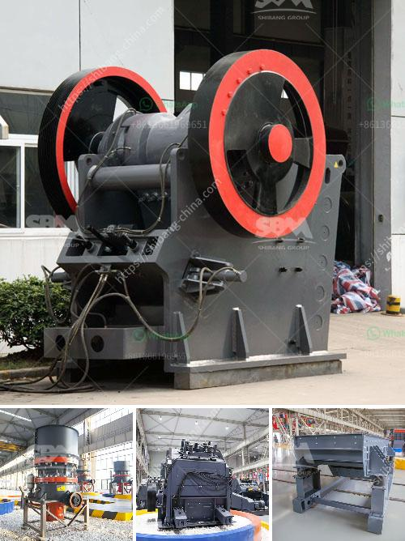

<h3>concrete crusher price</h3>
When it comes to concrete processing and recycling, the importance of efficiency and affordability cannot be overstated. Concrete is one of the most widely used construction materials in the world, and with good reason. Its durability, strength, and versatility make it a popular choice for various projects. However, when concrete structures or pavements need to be demolished or remodeled, the need for a reliable concrete crusher becomes evident.

Concrete crushers are essential equipment in the construction industry, with a wide range of options available. These crushers are specifically designed for breaking down concrete into smaller particles, facilitating the removal and recycling of concrete waste. Efficiency, mobility, and cost-effectiveness are key factors to consider when purchasing a concrete crusher.

One of the primary factors that influence concrete crusher prices is the size of the machine. Generally, crushers come in two sizes: small and large. The small crushers are suitable for residential and smaller-scale construction projects, while the larger crushers are ideal for heavy-duty applications such as road construction or large-scale demolition. As expected, the smaller crushers are generally more affordable compared to their larger counterparts.

Another important aspect of pricing is the power and production capacity of the concrete crusher. Crushers with higher horsepower and greater production capacity tend to have a higher price. The power of the crusher is directly proportional to its ability to handle larger concrete pieces, resulting in higher productivity. Therefore, it is essential to assess the required power and production capacity based on the scale of your projects before finalizing your purchase decision.

The quality and durability of a concrete crusher are also significant factors in determining its price. Investing in a high-quality crusher may require a larger upfront investment, but it can pay off in the long run. Durable crushers with sturdy construction allow for reliable performance and reduced maintenance costs over time. Additionally, a well-built crusher can handle even the toughest concrete materials, providing greater versatility and overall value for your investment.

The level of automation and features offered by the crusher also play a role in pricing. Advanced features such as remote control operation, automatic crushing cycles, and adjustable settings increase the convenience and efficiency of the crusher. However, these additional features may come with a higher price tag compared to more basic models. Assessing the specific needs of your projects and evaluating the value-added features can help determine whether the extra investment is worthwhile.

Apart from the initial purchase price, it is essential to consider the long-term operating costs. Concrete crushers consume energy, and operating and maintenance costs need to be factored into your budget. It is advisable to choose a crusher that offers energy-saving features and easy maintenance to minimize ongoing expenses.

In conclusion, when purchasing a concrete crusher, it is crucial to find the right balance between affordability and functionality. Determining the appropriate size, power, production capacity, quality, and features based on your specific needs will help you make an informed decision. Consider both the upfront price and long-term operating costs to ensure a cost-effective investment. By carefully evaluating these factors, you can choose a concrete crusher that meets your requirements while staying within your budget.
<h3>Contact us</h3><ul><li><strong>Whatsapp:&nbsp;<a href="https://wa.me/8613661969651">+8613661969651</a></strong></li><li><a href="https://swt.shibang-china.com/?git&amp;zhl&amp;concrete crusher price"><strong>Online Service(chat now)</strong></a></li></ul><h3>Related</h3><ul><li><a href='recycled glass countertops south africa.md'>recycled glass countertops south africa</a></li><li><a href='primary crusher ball milling pengertian.md'>primary crusher ball milling pengertian</a></li><li><a href='trapezium grinding mill.md'>trapezium grinding mill</a></li><li><a href='grinding machines for brick.md'>grinding machines for brick</a></li><li><a href='mineral crushing plant.md'>mineral crushing plant</a></li></ul>