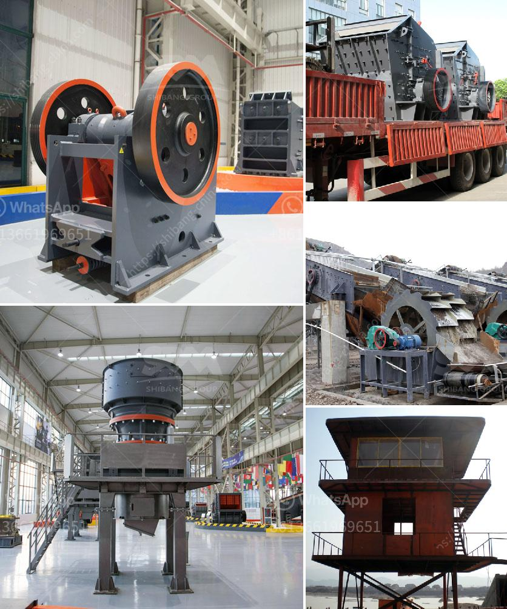

<h3>concrete crushing machine for sale</h3>
Concrete crushing machines are used to reduce the size of concrete for various purposes such as constructing roads, bridges, and buildings. The process involves breaking up larger pieces into smaller chunks, making it easier to transport and recycle the crushed material. This article will explore the benefits of using a concrete crushing machine for sale.

One of the primary advantages of using a concrete crushing machine is that it allows you to recycle concrete waste, which in turn helps you save money and reduce your carbon footprint. Instead of disposing of concrete waste in landfills, you can crush it and repurpose it for future projects. This not only helps the environment but also reduces the need for extracting new materials, conserving natural resources.

Another benefit is that a concrete crushing machine allows you to create a more sustainable construction process. By reusing crushed concrete, you can decrease the demand for traditional aggregates, such as gravel and sand. This reduces the strain on natural resources and reduces the impact of mining on the environment. Additionally, using crushed concrete in construction projects can contribute to LEED (Leadership in Energy and Environmental Design) certification, as it is considered a sustainable building material.

When considering a concrete crushing machine for sale, it is important to select a machine that meets your specific needs. Factors to consider include the size of the machine, its capability to handle different types of concrete, production capacity, and ease of operation. It is also crucial to choose a reliable manufacturer or supplier with a good reputation in the market.

In terms of machine size, it should be able to handle the amount of concrete waste you expect to process. If you have a large-scale construction project, you may require a higher production capacity machine. However, if you only need to crush small amounts of concrete occasionally, a smaller machine will suffice. Additionally, consider the space available at your site to accommodate the machine.

Different concrete crushing machines are designed to handle various types of concrete, including reinforced concrete, precast concrete, and even asphalt. Some machines have specific features that allow them to process certain types of concrete more efficiently. Therefore, it is crucial to choose a machine that is suitable for the type of concrete waste you have.

Considering the ease of operation is also important, especially if you plan to operate the machine yourself. Look for a machine that has a user-friendly control panel, clear instructions, and easy maintenance procedures. Safety features, such as emergency stop buttons and protective covers, should also be present to ensure operator safety.

In summary, a concrete crushing machine offers numerous benefits such as cost savings, environmental sustainability, and improved construction processes. When choosing a machine, consider factors such as size, capability, production capacity, and ease of operation. By investing in a quality concrete crushing machine, you can efficiently recycle concrete waste and contribute to a greener and more sustainable construction industry.
<h3>Contact us</h3><ul><li><strong>Whatsapp:&nbsp;<a href="https://wa.me/8613661969651">+8613661969651</a></strong></li><li><a href="https://swt.shibang-china.com/?git&amp;zhl&amp;concrete crushing machine for sale"><strong>Online Service(chat now)</strong></a></li></ul><h3>Related</h3><ul><li><a href='different between the mill and hammer crusher.md'>different between the mill and hammer crusher</a></li><li><a href='hammer mill dimension.md'>hammer mill dimension</a></li><li><a href='sale of old hammer crusher.md'>sale of old hammer crusher</a></li><li><a href='rubble crushing machine.md'>rubble crushing machine</a></li><li><a href='crusher machine company in spain.md'>crusher machine company in spain</a></li></ul>