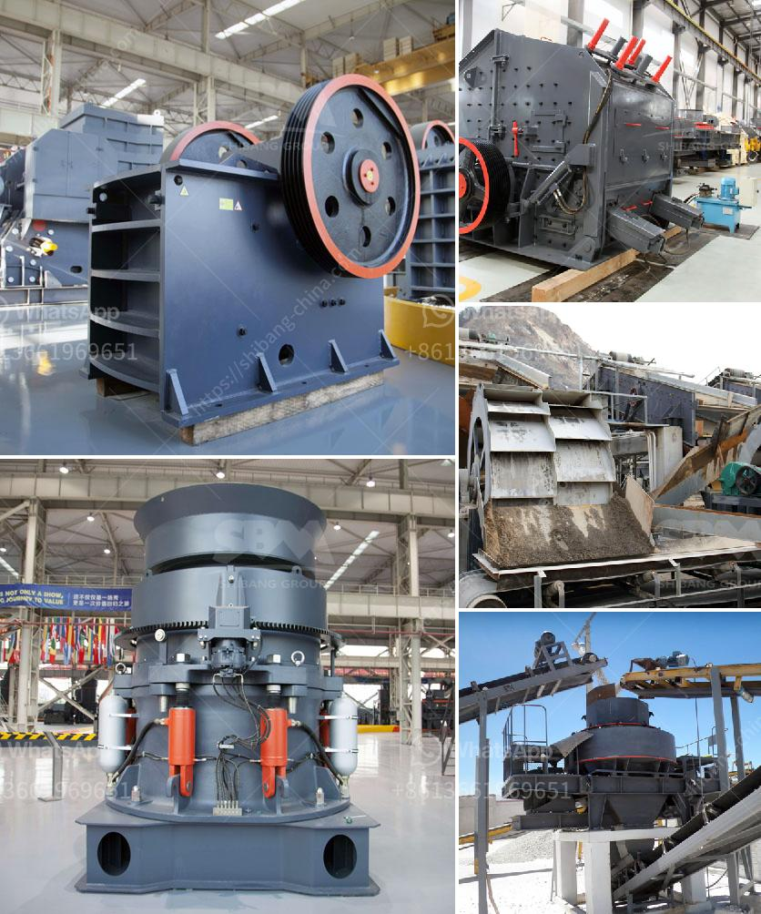

<h3>concrete grinding machine manufacturers</h3>
Concrete grinding machines have revolutionized the construction and maintenance industry with their ability to efficiently and effectively grind and polish concrete surfaces. As the demand for polished concrete continues to grow, so does the need for high-quality equipment manufactured by reliable and reputable companies. This article aims to shed light on some of the prominent manufacturers in this field, showcasing their expertise and the innovative technologies they employ.

Diamatic is a global leader in the manufacturing of concrete grinding and polishing machines. With over 100 years of collective experience, they offer a wide range of equipment suitable for both small-scale residential projects and large commercial ventures. Diamatic machines are known for their precision and durability, ensuring the highest quality results. They also focus on environmental sustainability by producing equipment with reduced dust emissions and lower energy consumption.

Husqvarna, a Swedish-based company, is renowned for its cutting-edge technology and innovative designs. Their range of concrete grinding machines covers everything from small handheld grinders to large planetary grinders suited for industrial applications. They prioritize user-friendliness and ergonomics, making their machines comfortable and easy to operate. Husqvarna also offers a wide array of diamond tooling options, ensuring the proper abrasives for any concrete grinding project.

HTC, a Swedish manufacturer, is well-known for its advanced floor grinding and polishing equipment. Their machines are designed for maximum performance, productivity, and precision. HTC takes pride in their three principles: speed, efficiency, and ergonomics. Their machines offer high rotational speeds, allowing for quick material removal, and are equipped with advanced dust management systems to enhance workplace safety and cleanliness.

Blastrac, a Dutch manufacturer, specializes in surface preparation equipment, including concrete grinders and polishers. Their machines are known for their versatility, allowing for efficient grinding, polishing, and surface preparation on various types of concrete surfaces. Blastrac's focus on ergonomic design and user-friendly features makes operating their machinery more comfortable and less strenuous for the operator.

WerkMaster is a Canadian company that prides itself on manufacturing robust and reliable concrete grinding and polishing machines. They offer a diverse range of equipment suitable for different project sizes and types. WerkMaster machines focus on delivering exceptional results while minimizing the time and effort required for operation. Additionally, they strive for eco-friendly manufacturing by incorporating sustainable materials and reducing energy consumption.

Concrete grinding machines have become essential tools for achieving smooth and polished concrete surfaces. The manufacturers mentioned above demonstrate excellence in the production of these machines, continually improving their technology and design to meet the growing demands of diverse industries. Whether it is Diamatic, Husqvarna, HTC, Blastrac, or WerkMaster, these reputable manufacturers offer a wide variety of high-quality and innovative equipment to cater to every concrete grinding need. As the industry continues to evolve, it is crucial to rely on trusted manufacturers who prioritize performance, efficiency, and sustainability.
<h3>Contact us</h3><ul><li><strong>Whatsapp:&nbsp;<a href="https://wa.me/8613661969651">+8613661969651</a></strong></li><li><a href="https://swt.shibang-china.com/?git&amp;zhl&amp;concrete grinding machine manufacturers"><strong>Online Service(chat now)</strong></a></li></ul><h3>Related</h3><ul><li><a href='crushing plant assembly.md'>crushing plant assembly</a></li><li><a href='estimated cost of setting up a quarry.md'>estimated cost of setting up a quarry</a></li><li><a href='how to calculate the powder conveying rate.md'>how to calculate the powder conveying rate</a></li><li><a href='stone crusher plant management software.md'>stone crusher plant management software</a></li><li><a href='calcium carbonate proses by process.md'>calcium carbonate proses by process</a></li></ul>