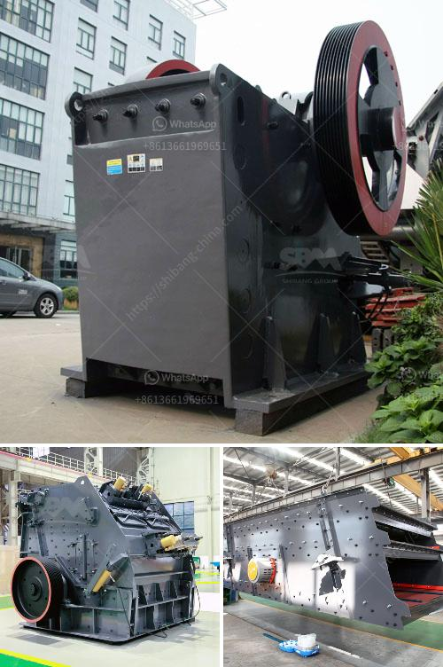

<h3>concrete recycling equipment manufacturers</h3>
Concrete recycling equipment plays a crucial role in the construction industry as it helps to reduce waste and promote sustainability. These machines are designed to break down and recycle concrete waste into reusable aggregates, which can be used for various construction purposes. In recent years, the demand for concrete recycling equipment has been increasing, leading to the emergence of several manufacturers in the market. In this article, we will explore some of the top concrete recycling equipment manufacturers.

1. Liebherr Group: Liebherr is a global leader in the manufacturing of construction machinery and equipment, including concrete recycling equipment. They offer a wide range of innovative and efficient machines that are designed to handle various capacities of concrete waste. Liebherr's recycling plants are known for their high-quality construction, advanced technology, and low operating costs, making them a popular choice among contractors and recyclers worldwide.

2. Rubble Master: Rubble Master is a well-known manufacturer of compact crushing equipment for concrete recycling. Their machines are designed to process a wide range of materials, including concrete, asphalt, and demolition waste. Rubble Master's mobile crushers are compact and can be easily transported to construction sites, making them highly convenient for on-site recycling operations. They are also known for their high-performance capabilities and low maintenance requirements.

3. Metso Outotec: Metso Outotec is a leading provider of sustainable solutions for the mining, aggregates, and construction industries. They offer a range of concrete recycling equipment, including crushers, screens, and conveyors. Metso Outotec's equipment is designed to maximize the recovery of valuable aggregates and minimize waste, ensuring a sustainable approach to concrete recycling. They focus on energy efficiency, durability, and ease of operation, making their equipment reliable and cost-effective.

4. Terex Corporation: Terex Corporation is a global manufacturer of lifting and material handling solutions, including concrete recycling equipment. Their product portfolio includes crushers, screens, and conveyors designed specifically for concrete recycling applications. Terex's equipment is known for its robust construction, high productivity, and low operating costs. They offer a wide range of models to suit different requirements, allowing contractors to choose the most suitable equipment for their recycling operations.

5. Eagle Crusher Company: Eagle Crusher Company is a manufacturer of heavy-duty crushing equipment for the recycling and aggregate industries. They offer a range of portable and stationary concrete crushers, screens, and conveyors that are designed to handle concrete waste efficiently. Eagle Crusher's machines are known for their durability, performance, and ease of maintenance. They also provide excellent customer support and after-sales service, ensuring customer satisfaction.

In conclusion, concrete recycling equipment manufacturers play a crucial role in promoting sustainable construction practices. The aforementioned manufacturers are some of the top players in the industry, known for their innovative and efficient equipment. By investing in quality concrete recycling equipment, contractors can reduce waste, conserve natural resources, and contribute to a greener environment.
<h3>Contact us</h3><ul><li><strong>Whatsapp:&nbsp;<a href="https://wa.me/8613661969651">+8613661969651</a></strong></li><li><a href="https://swt.shibang-china.com/?git&amp;zhl&amp;concrete recycling equipment manufacturers"><strong>Online Service(chat now)</strong></a></li></ul><h3>Related</h3><ul><li><a href='sand making machine suppliers in south africa.md'>sand making machine suppliers in south africa</a></li><li><a href='crusher plant business requirement in paistan.md'>crusher plant business requirement in paistan</a></li><li><a href='iron slag crusher india.md'>iron slag crusher india</a></li><li><a href='calcium carbonate plant price.md'>calcium carbonate plant price</a></li><li><a href='industrial limestone crusher.md'>industrial limestone crusher</a></li></ul>