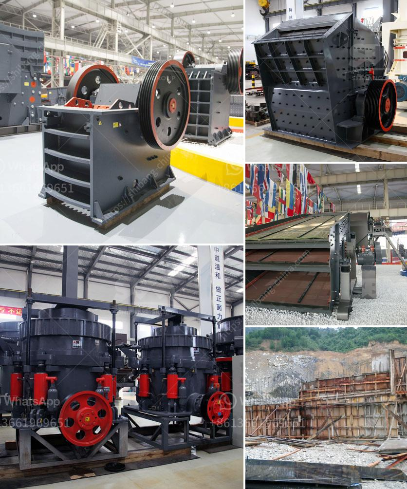

<h3>cone crusher 250tph</h3>
The cone crusher is a great choice as secondary crusher in combination with a jaw or a primary gyratory crusher or in the third or fourth crushing stage. Thanks to their built-in versatility, these crushers will enable you to cope with most production requirements in a changing future.

This cone crusher 250tph is designed for both tough and demanding quarrying, mining, and contracting applications. Its equipped with a high-capacity crushing chamber, a large feed opening, and compact transport dimensions. The cone crusher utilizes the well proven Symons cone crusher technology, ensuring high-performance and reliable operation.

The cone crusher 250tph is commonly used in intermediate crushing, capable of processing a variety of materials including iron ore, copper ore, limestone, granite, and basalt. For maximum capacity, the cone crusher features a steep crushing chamber angle, high eccentric throw, and a constant intake opening.

This cone crusher 250tph is also equipped with a hydraulic setting adjustment system, allowing for easy adjustment of the crusher settings to match the materials and production requirements. Additionally, the automatic setting regulation system ensures a consistent product size and shape, optimizing the production process.

With its robust construction, versatile features, and high capacity, the cone crusher 250tph is an efficient and economical choice for a wide range of applications. Whether you need to process hard and abrasive materials or achieve a high reduction ratio in a tertiary or quaternary crushing stage, this cone crusher is designed to deliver consistent performance and excellent end-product quality.

In conclusion, the cone crusher 250tph offers a cost-effective solution for medium to large-sized applications. Its reliable performance, compact design, and advanced features make it a valuable addition to any mining or quarrying operation. Choose this cone crusher for maximum productivity and low operational costs, and experience the benefits of a well-designed and efficient crushing machine.
<h3>Contact us</h3><ul><li><strong>Whatsapp:&nbsp;<a href="https://wa.me/8613661969651">+8613661969651</a></strong></li><li><a href="https://swt.shibang-china.com/?git&amp;zhl&amp;cone crusher 250tph"><strong>Online Service(chat now)</strong></a></li></ul><h3>Related</h3><ul><li><a href='stone crusher jaw mini produksi indonesia.md'>stone crusher jaw mini produksi indonesia</a></li><li><a href='bauxite processing plant.md'>bauxite processing plant</a></li><li><a href='grinding machine parts and their functions.md'>grinding machine parts and their functions</a></li><li><a href='diamond screening equipment for sale.md'>diamond screening equipment for sale</a></li><li><a href='stone crusher machine tutorials.md'>stone crusher machine tutorials</a></li></ul>