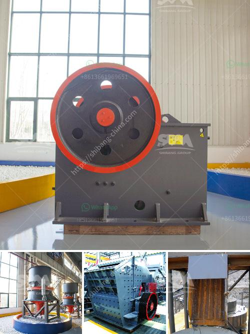

<h3>cone crusher specifications</h3>
Cone crushers are an integral part of any aggregate project, providing a reliable and efficient way to crush rocks and reduce them into smaller sizes for further use. Depending on the material being crushed, cone crushers can be used in a variety of applications, including mining, quarrying, demolition, recycling, and more. To understand the specifications of cone crushers, let's delve into the details.

Firstly, let's understand the basic components of a cone crusher. The main parts of a cone crusher include the feed hopper, mantle, concaves, eccentric shaft, bowl liner, adjusting mechanism, dust seal, drive assembly, and the support structure. With these components working together, cone crushers can deliver higher reduction ratios compared to jaw crushers.

When it comes to the specifications of cone crushers, there are three main factors to consider: the maximum feed size, the closed side setting (CSS), and the desired end product size. The maximum feed size refers to the largest particle that the crusher can accept. It is crucial to select a cone crusher with a maximum feed size that is suitable for the application to ensure efficient and effective crushing.

The closed side setting (CSS) refers to the distance between the mantle and concaves at the bottom of the crusher chamber. It determines the size of the crushed product and plays a significant role in controlling the particle shape and size distribution. A smaller CSS produces finer-sized end products, while a larger CSS results in coarser-sized products.

Additionally, cone crusher specifications often include the minimum discharging size. This specification is important because it helps to determine the capacity of the crusher. A smaller minimum discharging size allows for a higher capacity, as the crusher can handle more material at once. However, it's important to strike a balance between capacity and end product size, as reducing the minimum discharging size too much can negatively impact the overall efficiency of the cone crusher.

Cone crusher specifications also include the power requirements for typical operating conditions, such as the motor power, the voltage, and the frequency of the power supply. These specifications are crucial for determining the suitable power supply and ensuring that the cone crusher operates optimally.

Another important factor to consider is the wear parts of the cone crusher. The wear parts, including the mantle and concaves, need to be regularly inspected, maintained, and replaced when necessary, to ensure smooth operation and minimize downtime. The material used for the wear parts can also affect the crusher's performance and durability.

In conclusion, cone crusher specifications play a crucial role in determining the overall efficiency and performance of a cone crusher. Factors such as the maximum feed size, CSS, desired end product size, and power requirements should be carefully considered when selecting a cone crusher for a specific application. Regular maintenance and replacement of wear parts are also essential to ensure optimal performance. By understanding and adhering to these specifications, operators can maximize the productivity and longevity of their cone crushers.
<h3>Contact us</h3><ul><li><strong>Whatsapp:&nbsp;<a href="https://wa.me/8613661969651">+8613661969651</a></strong></li><li><a href="https://swt.shibang-china.com/?git&amp;zhl&amp;cone crusher specifications"><strong>Online Service(chat now)</strong></a></li></ul><h3>Related</h3><ul><li><a href='new rubber belt conveyor for sale.md'>new rubber belt conveyor for sale</a></li><li><a href='cement making process.md'>cement making process</a></li><li><a href='impact crusher discount.md'>impact crusher discount</a></li><li><a href='india 200 tpd cement plant cost.md'>india 200 tpd cement plant cost</a></li><li><a href='mining and machine in turkey.md'>mining and machine in turkey</a></li></ul>