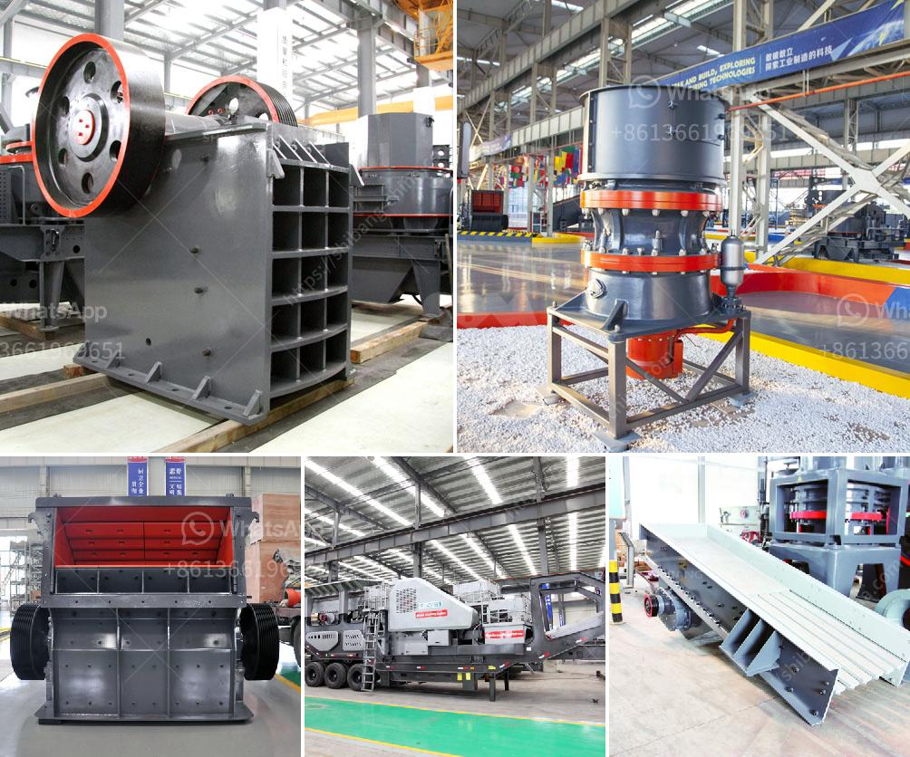

<h3>cone crusher suppliers</h3>
A cone crusher is a type of crushing equipment designed to crush materials into smaller particles. This equipment is used in a variety of industries, including mining, metallurgy, construction, and engineering. When choosing a cone crusher supplier, it's important to ensure that the supplier has a good reputation and offers quality products.

One of the key factors to consider is the supplier's experience and expertise in manufacturing cone crushers. A supplier with years of experience will have a better understanding of the industry requirements and can provide reliable and efficient crushers. It's also worth considering whether the supplier has provided cone crushers to well-established companies in the industry.

The quality of the cone crushers is another crucial factor. When purchasing such equipment, it's important to ensure that the supplier uses high-quality materials in the manufacturing process. This will result in a more durable and long-lasting crusher that can withstand heavy-duty use. Additionally, reputable suppliers often offer warranty options, ensuring that the customer's investment is protected.

Furthermore, excellent customer service is essential when choosing a cone crusher supplier. Reliable suppliers have knowledgeable and responsive customer support teams that can assist with any queries or technical issues that may arise. This will ensure a smooth purchasing process and efficient after-sales service.

An often overlooked aspect is the supplier's commitment to innovation and research. A supplier that invests in technology advancements and continuously improves its products can offer more efficient and cutting-edge cone crushers. These advanced features can help improve productivity and reduce downtime, ultimately benefiting the customer.

Price comparison is also vital when selecting a supplier. While it's important to find a supplier that offers competitive pricing, it's equally important to consider the overall value of the product. Cheaper options may compromise on quality, leading to higher maintenance costs or even premature replacement.

In conclusion, finding the right cone crusher supplier is essential for any company looking to invest in crushing equipment. It's crucial to consider the supplier's experience, quality of products, customer service, innovation, and pricing. By carefully evaluating these factors, businesses can make an informed decision and choose a reliable supplier that meets their specific crushing needs.
<h3>Contact us</h3><ul><li><strong>Whatsapp:&nbsp;<a href="https://wa.me/8613661969651">+8613661969651</a></strong></li><li><a href="https://swt.shibang-china.com/?git&amp;zhl&amp;cone crusher suppliers"><strong>Online Service(chat now)</strong></a></li></ul><h3>Related</h3><ul><li><a href='brick stone crusher machine.md'>brick stone crusher machine</a></li><li><a href='mica pearl process flowchart.md'>mica pearl process flowchart</a></li><li><a href='pebble crusher manufacturer.md'>pebble crusher manufacturer</a></li><li><a href='kenya quarry crusher.md'>kenya quarry crusher</a></li><li><a href='grinding a stone crusher.md'>grinding a stone crusher</a></li></ul>