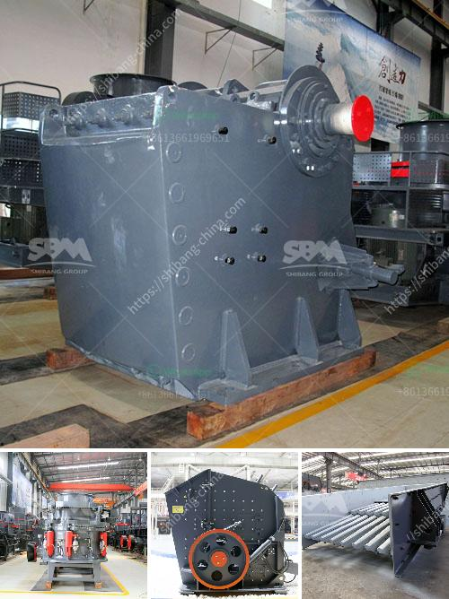

<h3>cone crushers made in italy</h3>
Cone crushers are popular rock crushing machines in aggregates production, mining operations, and recycling applications. They are normally used in secondary, tertiary, and quaternary crushing stages. However, in recent years, cone crushers have been increasingly used in primary crushing stages. With advancements in technology and innovative design, cone crushers made in Italy are redefining the way crushing is handled.

One of the standout features of cone crushers made in Italy is their ability to crush hard, abrasive rocks efficiently through the use of cutting-edge technology. The design of the machines includes several patented features that ensure high performance and reliability. These features include:

1. Advanced crushing dynamics: Italy-made cone crushers utilize a unique combination of motion, speed, and eccentric throw to deliver excellent performance even with the hardest rocks. The optimized motion allows for a larger crushing stroke, which increases the interparticle crushing action for better end-product shape and overall efficiency.

2. Robust construction: The cone crushers manufactured in Italy are built to withstand extreme conditions and heavy-duty applications. They are constructed with high-quality materials and components that offer outstanding durability and reliability. This ensures that the machines can handle the demanding working environments of quarries and mines.

3. Easy maintenance: Cone crushers made in Italy are designed with maintenance in mind. Their accessibility and ease of maintenance make them ideal for reducing downtime and optimizing productivity. Components such as the hydraulic system and engine can be easily accessed and serviced, minimizing the time and effort required.

4. Versatile applications: Italy-made cone crushers are suitable for a wide range of applications. They can be used to crush various types of rocks, including granite, basalt, and limestone. Whether it's in aggregates production, mining operations, or recycling, these machines can effectively process the material to the desired size and shape.

5. Environmental-friendly operation: Cone crushers made in Italy are also designed with sustainability in mind. They are equipped with advanced technology that ensures efficient energy utilization. This not only reduces operational costs but also minimizes the impact on the environment.

Overall, cone crushers made in Italy have proven to be reliable and efficient crushing machines in various industries. Their unique features, such as advanced crushing dynamics, robust construction, easy maintenance, and versatile applications, set them apart from other crushers in the market. Additionally, their eco-friendly operation is in line with the growing demand for sustainable solutions in the industry.

If you are in the market for a cone crusher that offers exceptional performance and durability, consider choosing one made in Italy. These machines combine cutting-edge technology with Italian craftsmanship to deliver outstanding results. With their ability to crush even the hardest rocks efficiently, cone crushers made in Italy are reshaping the modern crushing industry.
<h3>Contact us</h3><ul><li><strong>Whatsapp:&nbsp;<a href="https://wa.me/8613661969651">+8613661969651</a></strong></li><li><a href="https://swt.shibang-china.com/?git&amp;zhl&amp;cone crushers made in italy"><strong>Online Service(chat now)</strong></a></li></ul><h3>Related</h3><ul><li><a href='feldspar vsi crusher.md'>feldspar vsi crusher</a></li><li><a href='gravel vibrating screen.md'>gravel vibrating screen</a></li><li><a href='limestone powder conveying system.md'>limestone powder conveying system</a></li><li><a href='gypsum crushing machines in pakistan.md'>gypsum crushing machines in pakistan</a></li><li><a href='quartz rock processing equipment.md'>quartz rock processing equipment</a></li></ul>