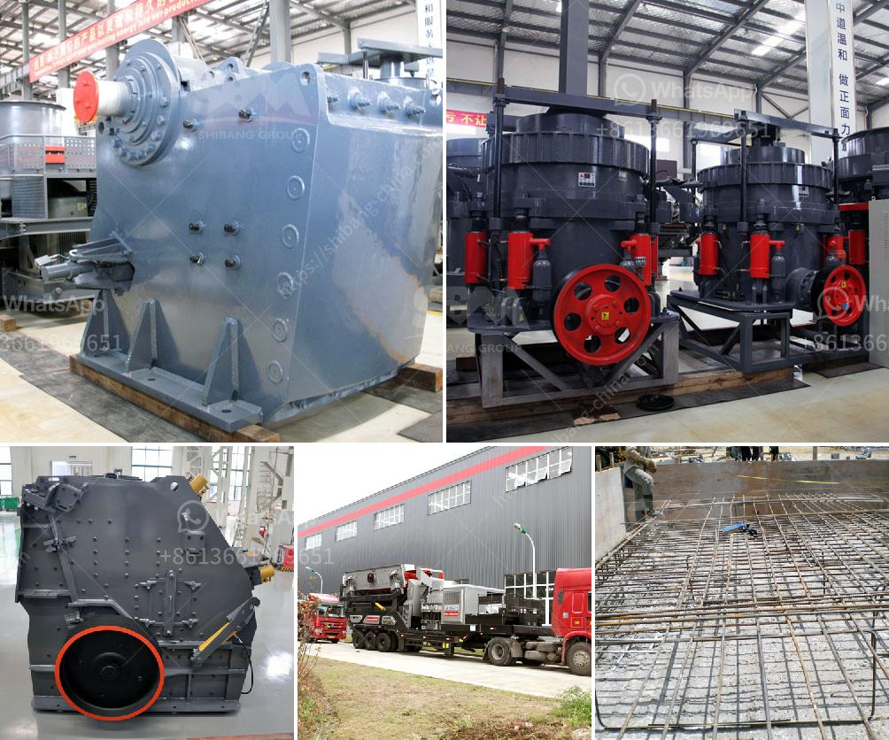

<h3>consumption of ball mill with roller</h3>
The ball mill with roller is a kind of power consumption device that uses the roller as the grinding medium to crush the material. Compared with the traditional ball mill, this kind of ball mill with roller has the following advantages:

Firstly, the structure design of the equipment is scientific and reasonable, which not only saves the space for the customer but also reduces the investment cost. The roller is used as the grinding medium, which can greatly reduce the consumption of steel balls. At the same time, the roller can rotate freely in the ball mill, which can effectively reduce the friction resistance and energy consumption during the operation.

Secondly, the ball mill with roller has a high grinding efficiency. The roller in the ball mill can move up and down and rotate freely, which can greatly improve the grinding efficiency of the material. The roller can crush the material by rolling and grinding, so as to achieve the purpose of grinding the material to the desired fineness.

Thirdly, the ball mill with roller has a good sealing performance. The roller has a certain distance from the grinding disc, so the sealing performance between the roller and the grinding disc is relatively good. This can effectively prevent the dust from overflowing during the operation of the equipment, and greatly reduce the pollution to the environment.

Fourthly, the ball mill with roller has a low wear rate and long service life of the lining plate. Since the roller acts as the grinding medium, it can reduce the impact and wear of the material on the lining plate. At the same time, the roller rotates along the grinding disc, which can evenly distribute the material on the lining plate, and greatly reduce the local wear of the lining plate.

Fifthly, the ball mill with roller has a wide range of applications. It can be used for grinding various materials, such as cement, raw materials, clinker, coal powder, slag, etc. It has been widely used in the cement industry, power industry, chemical industry, and other fields.

In conclusion, the ball mill with roller is a kind of power consumption device that uses the roller as the grinding medium to crush the material. It has the advantages of scientific and reasonable structure design, high grinding efficiency, good sealing performance, low wear rate, long service life of the lining plate, and wide application range. It is an ideal equipment for grinding various materials and has great market potential in various industries.
<h3>Contact us</h3><ul><li><strong>Whatsapp:&nbsp;<a href="https://wa.me/8613661969651">+8613661969651</a></strong></li><li><a href="https://swt.shibang-china.com/?git&amp;zhl&amp;consumption of ball mill with roller"><strong>Online Service(chat now)</strong></a></li></ul><h3>Related</h3><ul><li><a href='set up stone crusher plant.md'>set up stone crusher plant</a></li><li><a href='quote industrial mill quote ball mills.md'>quote industrial mill quote ball mills</a></li><li><a href='ball mill nigeria.md'>ball mill nigeria</a></li><li><a href='classifier of cement ball mill.md'>classifier of cement ball mill</a></li><li><a href='galena crushing and processing.md'>galena crushing and processing</a></li></ul>