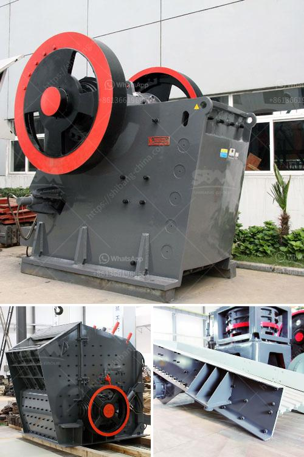

<h3>conveyor belt manufacturers in bangladesh</h3>
Bangladesh, a developing nation in South Asia, has been witnessing rapid industrialization and growth in various sectors. With a focus on increasing productivity, streamlining processes, and embracing automation, there has been a rising demand for conveyor systems. Conveyor belts play a crucial role in optimizing workflow and ensuring smooth operations in industries ranging from textiles to automobiles and food processing. The significant growth in demand has led to the emergence of several conveyor belt manufacturers in Bangladesh, catering to the diverse needs of the industrial sector.

One of the key reasons for the increased demand for conveyor systems in Bangladesh is the need to enhance operational efficiency and reduce labor costs. Traditional methods of material handling involve significant manpower and are prone to errors and delays. Conveyor belts provide a cost-effective solution by automating the movement of materials, streamlining processes, and minimizing human intervention. This not only saves time but also improves overall efficiency, leading to increased productivity and output.

Bangladesh's textile industry, one of the largest contributors to the country's economy, relies heavily on conveyor systems for various production processes. Conveyor belts are used for handling raw materials, transporting fabrics, and sorting finished products. The textile industry demands conveyor systems capable of handling large volumes of materials with precision and reliability. Conveyor belt manufacturers in Bangladesh focuses on providing tailor-made solutions that meet the specific requirements of textile factories, ensuring seamless material flow and reducing downtime.

The food processing industry is another sector where conveyor belts are gaining popularity in Bangladesh. With the growing demand for processed and packaged food items, there is a need for efficient handling and transfer of raw materials, ingredients, and finished products. Conveyor belts designed for the food industry prioritize hygiene, easy cleaning, and compliance with food safety standards. Conveyor belt manufacturers in Bangladesh understand the specific requirements of the food processing industry and provide stainless steel belts with specialized coatings for durability and cleanliness.

Automobile manufacturing is another sector witnessing a rise in demand for conveyor systems in Bangladesh. Conveyor belts are used extensively in automobile assembly lines for the movement of components, sub-assemblies, and finished vehicles. Conveyor belt manufacturers in Bangladesh offer solutions that are adaptable to different production layouts, ensuring smooth material flow and seamless integration into existing systems. Conveyor systems reduce material handling time, minimize errors, and enhance productivity in the fast-paced automobile industry.

In conclusion, the increasing demand for conveyor systems in Bangladesh has led to the emergence of several conveyor belt manufacturers in the country. These manufacturers focus on providing efficient, reliable, and cost-effective solutions to meet the specific needs of various industries. The textile, food processing, and automobile industries, in particular, have experienced significant benefits from the adoption of conveyor systems. As Bangladesh continues to experience industrial growth and automation, the importance of conveyor belt manufacturers in meeting the evolving demands cannot be overstated. These manufacturers play a crucial role in enhancing operational efficiency, optimizing workflow, and driving the country's industrial progress.
<h3>Contact us</h3><ul><li><strong>Whatsapp:&nbsp;<a href="https://wa.me/8613661969651">+8613661969651</a></strong></li><li><a href="https://swt.shibang-china.com/?git&amp;zhl&amp;conveyor belt manufacturers in bangladesh"><strong>Online Service(chat now)</strong></a></li></ul><h3>Related</h3><ul><li><a href='black stone crushing nigeria.md'>black stone crushing nigeria</a></li><li><a href='manufacturer of cement packing plant machinery.md'>manufacturer of cement packing plant machinery</a></li><li><a href='fly ash processing plant for sale.md'>fly ash processing plant for sale</a></li><li><a href='cobalt concentrate processing equiopment manufacturers.md'>cobalt concentrate processing equiopment manufacturers</a></li><li><a href='industrial roller mill.md'>industrial roller mill</a></li></ul>