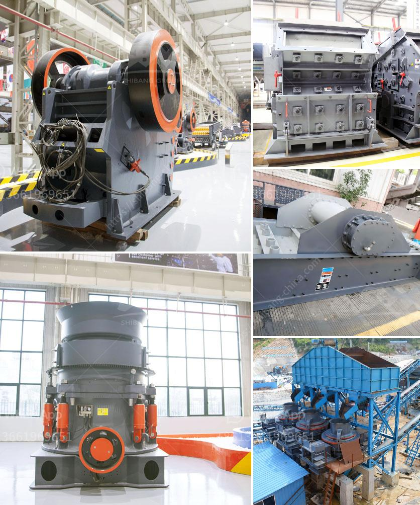

<h3>conveyor belt seller in philippines</h3>
In the fast-paced world of logistics and manufacturing, conveyor belts play a crucial role in ensuring the smooth and efficient movement of goods from one point to another. These indispensable systems have become a common sight in industries such as mining, agriculture, food processing, and packaging. With the demand for conveyor belts steadily rising, the need for reliable and high-quality suppliers has become paramount. In the Philippines, there are several conveyor belt sellers that cater to the diverse needs of businesses, offering efficient solutions that maximize productivity.

One such conveyor belt seller in the Philippines is Conveytech Manufacturing. With a solid reputation built over years of experience, they have become an industry leader in providing customized conveyor systems to various sectors. They understand the unique requirements of each client and offer tailor-made solutions that address specific challenges.

Conveytech Manufacturing takes pride in their extensive range of conveyor belts, ensuring that they can meet the demands of diverse industries. From lightweight and medium-duty belts for industries such as retail and logistics, to heavy-duty belts used in mining and extraction, they offer a comprehensive selection suited for different applications. Additionally, they also provide specialized belts designed for specific requirements like oil and heat resistance, anti-static properties, and more.

Quality is a top priority for Conveytech Manufacturing. They only source conveyor belts from trusted manufacturers who adhere to international standards. Each belt undergoes rigorous testing to ensure durability, reliability, and longevity. Businesses can rest assured that the conveyor belts they purchase are built to withstand the demands of their operations, minimizing downtime and optimizing productivity.

Aside from providing conveyor belts, Conveytech Manufacturing also offers additional products and services that enhance the overall conveyor system. They have a wide range of accessories such as rollers, belt cleaners, belt trackers, and impact beds, among others, to optimize the functionality of the conveyor system. Moreover, they provide maintenance and repair services to ensure that the conveyor belts operate at peak performance throughout their lifespan.

Conveytech Manufacturing takes pride in their team of skilled engineers and technicians who understand the intricacies of conveyor systems. They work closely with clients, conducting site visits and assessments to gain in-depth knowledge of the business operations. This enables them to provide accurate recommendations and solutions tailored to the specific requirements of each client.

Beyond their product offerings and expertise, what sets Conveytech Manufacturing apart is their dedication to customer satisfaction. They prioritize building strong and lasting relationships with their clients, striving to exceed expectations in every aspect. From the initial consultation to after-sales support, they value open communication and prompt response to ensure that clients feel supported and valued.

In conclusion, conveyor belt sellers in the Philippines, such as Conveytech Manufacturing, are instrumental in providing efficient solutions to businesses across various industries. Their extensive range of conveyor belts, adherence to quality standards, and commitment to customer satisfaction set them apart in the market. By choosing a reliable conveyor belt seller, businesses can streamline their operations, boost productivity, and ultimately achieve their goals in the ever-evolving world of logistics and manufacturing.
<h3>Contact us</h3><ul><li><strong>Whatsapp:&nbsp;<a href="https://wa.me/8613661969651">+8613661969651</a></strong></li><li><a href="https://swt.shibang-china.com/?git&amp;zhl&amp;conveyor belt seller in philippines"><strong>Online Service(chat now)</strong></a></li></ul><h3>Related</h3><ul><li><a href='10 inches marble grinding stone.md'>10 inches marble grinding stone</a></li><li><a href='calcium carbonate manufacturing in egypt.md'>calcium carbonate manufacturing in egypt</a></li><li><a href='stone crushing production process.md'>stone crushing production process</a></li><li><a href='for sale mobile crusher.md'>for sale mobile crusher</a></li><li><a href='lme copper ore price calculations.md'>lme copper ore price calculations</a></li></ul>