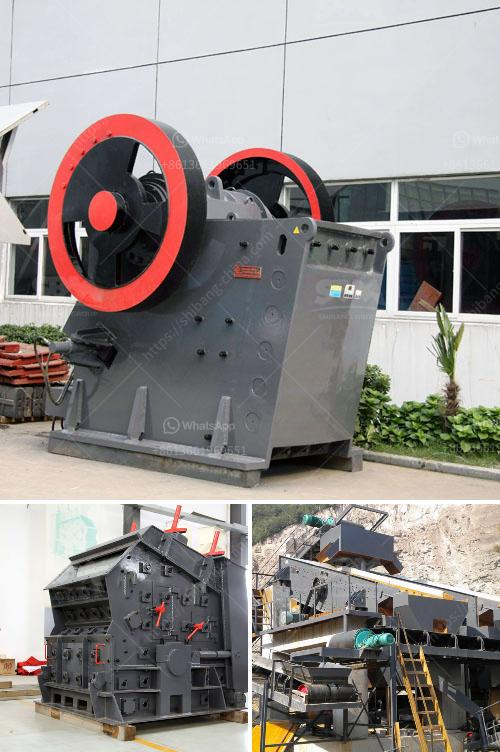

<h3>conveyor belt structure design</h3>
Conveyor belts are used in various industries for the transportation of goods and materials from one place to another. They are an essential component of many production and manufacturing processes. The design of conveyor belts plays a crucial role in ensuring efficient and reliable operation while minimizing maintenance and downtime. In this article, we will discuss the structure design of conveyor belts and its key components.

The structure design of a conveyor belt primarily includes the belt carcass and reinforcement layers. The carcass provides the tensile strength and shape required for the belt to function properly. It consists of multiple layers of fabric or other materials, such as steel cords or synthetic fibers, which are bonded together with rubber or other polymers.

The selection of the carcass material depends on the specific requirements of the application. For example, in industries like mining or heavy-duty material handling, steel cord carcasses are preferred due to their high tensile strength and resistance to impact and abrasion. On the other hand, industries like food processing or pharmaceuticals might require carcasses made of synthetic fibers that are easy to clean and meet hygiene standards.

Reinforcement layers are added to enhance the strength and durability of the belt. These layers are typically made of fabric, steel cords, or composite materials, and they are embedded within the rubber cover. The number and arrangement of reinforcement layers depend on the load capacity and operating conditions of the conveyor belt.

Another important component of conveyor belt structure design is the cover. The cover protects the carcass and reinforcement layers from external factors such as wear, impact, and chemicals. It is made of a rubber compound that is resistant to abrasion, heat, oil, and other substances. The thickness and type of cover are determined by the specific operating conditions of the conveyor belt. For instance, belts used in high-temperature environments may require heat-resistant covers, while belts used in industries involving chemicals must have covers that can withstand chemical exposure.

In addition to the carcass and cover, the conveyor belt structure incorporates other elements such as belt fasteners, idlers, and pulleys. Belt fasteners secure the ends of the belt together, enabling it to form an endless loop. They come in various types, including mechanical fasteners or vulcanized splices. Idlers support the belt and ensure smooth movement by minimizing friction and reducing stress on the belt. Pulleys are responsible for driving or redirecting the belt, effectively transferring power from the motor to the conveyor system.

Overall, the structure design of a conveyor belt is crucial for ensuring its performance, durability, and safety. Each component must be carefully selected and designed to meet the specific requirements of the application. Proper maintenance and regular inspections are also essential to identify any potential issues and prevent breakdowns or accidents. By investing in a well-designed conveyor belt structure, industries can improve their productivity and achieve seamless material transportation.
<h3>Contact us</h3><ul><li><strong>Whatsapp:&nbsp;<a href="https://wa.me/8613661969651">+8613661969651</a></strong></li><li><a href="https://swt.shibang-china.com/?git&amp;zhl&amp;conveyor belt structure design"><strong>Online Service(chat now)</strong></a></li></ul><h3>Related</h3><ul><li><a href='ball mill nigeria.md'>ball mill nigeria</a></li><li><a href='buy and sell conveyor belts in south africa.md'>buy and sell conveyor belts in south africa</a></li><li><a href='gypsum washing plant.md'>gypsum washing plant</a></li><li><a href='mini crusher for gravel.md'>mini crusher for gravel</a></li><li><a href='blast slag grinding machine india.md'>blast slag grinding machine india</a></li></ul>