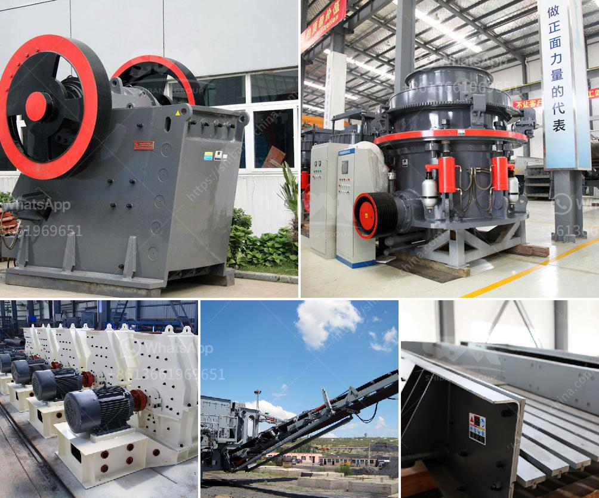

<h3>conveyor belt system manufacturers in turkey</h3>
Turkey has rapidly become one of the leading manufacturers of conveyor belts in the world. With its economy growing at an impressive rate, the demand for products such as conveyor belts has increased exponentially. This has led to the emergence of numerous conveyor belt system manufacturers in the country, catering not only to the local market but also exporting their products to various countries worldwide.

These manufacturers utilize state-of-the-art technology and employ skilled engineers to design and produce conveyor belt systems that are durable, efficient, and tailored to the specific needs of industries such as mining, agriculture, logistics, and manufacturing. The conveyor belts they produce are used for various applications, including bulk material handling, mining operations, food processing, and packaging.

One of the notable Turkish conveyor belt system manufacturers is Duratech. The company has been operating since 2008 and has gained a solid reputation as a reliable conveyor belt provider. Duratech offers a wide range of belt types, including PVC, PU, rubber, and metal, to cater to diverse industry requirements. They also provide customization options to meet specific needs.

Another prominent manufacturer in Turkey is ProSpare. With a focus on providing high-quality conveyor belt systems and components, ProSpare has established a strong presence in the market. The company offers a comprehensive range of products, such as conveyor belts, rollers, pulleys, and belt cleaners, ensuring a complete solution for their customers' needs.

Additionally, Turkey is known for its competitive pricing in the conveyor belt industry. The manufacturers in the country offer cost-effective solutions without compromising on quality. This makes them highly preferred by businesses looking for reliable and affordable conveyor belt systems.

In conclusion, Turkey has emerged as a significant player in the conveyor belt system manufacturing industry. The country's conveyor belt manufacturers have gained international recognition for their quality products, customization options, and competitive pricing. As the demand for conveyor belts continues to rise, Turkish manufacturers are well-positioned to cater to both domestic and global markets.
<h3>Contact us</h3><ul><li><strong>Whatsapp:&nbsp;<a href="https://wa.me/8613661969651">+8613661969651</a></strong></li><li><a href="https://swt.shibang-china.com/?git&amp;zhl&amp;conveyor belt system manufacturers in turkey"><strong>Online Service(chat now)</strong></a></li></ul><h3>Related</h3><ul><li><a href='dolomite ore processing.md'>dolomite ore processing</a></li><li><a href='300 tone per hour limestone crusher.md'>300 tone per hour limestone crusher</a></li><li><a href='stone crushers in kenya.md'>stone crushers in kenya</a></li><li><a href='jual grinding mill hammer mill philippines.md'>jual grinding mill hammer mill philippines</a></li><li><a href='forno paragon para venda.md'>forno paragon para venda</a></li></ul>