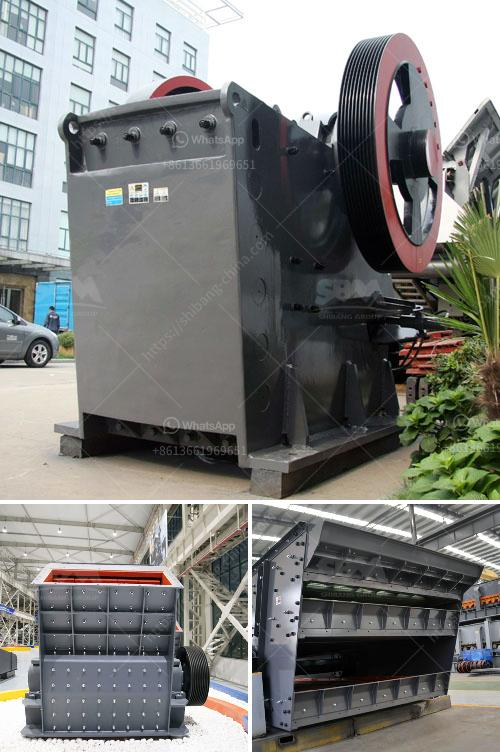

<h3>conveyor belts enginners in south africa</h3>
In today's fast-paced world, the manufacturing industry constantly strives to improve efficiencies, reduce costs, and enhance productivity. One essential element contributing to these advancements is the implementation of advanced machinery, such as conveyor belts. Conveyor belts have revolutionized industries by automating processes and streamlining operations. For this reason, conveyor belt engineers in South Africa play a crucial role in driving this transformation.

Conveyor belts are mechanical devices consisting of a continuous loop of material used to transport goods from one point to another. These belts are commonly used in industries such as mining, agriculture, food processing, and automotive manufacturing. By utilizing conveyor belts, companies can increase production rates, minimize manual labor, and reduce product damage.

South Africa is considered a hub for conveyor belt engineering due to its rich history in mining and manufacturing. Conveyor belt engineers in South Africa possess extensive knowledge and experience in designing, fabricating, and installing conveyor systems tailored to meet specific industry requirements. These engineers are well-versed in understanding the complex dynamics of various industries and possess the skills needed to provide innovative solutions.

One of the primary tasks of conveyor belt engineers is to design customized conveyor systems that meet the specific needs of their clients. From determining the required belt width and the appropriate materials for construction to considering factors like weight capacity and speed, meticulous attention to detail is paramount. These engineers work closely with clients to understand their processes, challenges, and desired outcomes.

Once the design phase is complete, conveyor belt engineers oversee the fabrication of the conveyor system. They ensure that all components are manufactured to the highest quality standards and meet industry regulations. This includes sourcing durable materials, selecting appropriate motors and drives, and incorporating safety features.

Installation is another critical aspect of the conveyor belt engineering process. Engineers are responsible for ensuring a smooth and efficient installation to minimize downtime and disruptions. They coordinate closely with other stakeholders, such as electricians and maintenance technicians, to guarantee seamless integration and proper functioning.

In addition to designing and installing conveyor systems, conveyor belt engineers also play a significant role in ongoing maintenance and repairs. Regular maintenance is essential to prevent equipment failure, optimize performance, and extend the lifespan of the conveyor system. Engineers conduct periodic inspections, clean and lubricate components, and replace worn-out parts as necessary. They are also readily available to address any unforeseen breakdowns and quickly troubleshoot issues to minimize production downtime.

The expertise of conveyor belt engineers in South Africa has contributed to significant advancements in the manufacturing industry. Their innovative solutions have enabled companies to increase their production capacities, improve operational efficiencies, and enhance worker safety. The expertise and skills possessed by these engineers have not only transformed the South African manufacturing industry but have also gained recognition on a global scale.

In conclusion, conveyor belts engineers in South Africa serve as the backbone of the manufacturing industry. Their comprehensive understanding of specific industry requirements, coupled with their expertise in designing, fabricating, installing, and maintaining conveyor systems, has revolutionized the way goods are transported and processed. As technology continues to evolve, the role of conveyor belt engineers in South Africa will continue to be instrumental in driving the future of manufacturing.
<h3>Contact us</h3><ul><li><strong>Whatsapp:&nbsp;<a href="https://wa.me/8613661969651">+8613661969651</a></strong></li><li><a href="https://swt.shibang-china.com/?git&amp;zhl&amp;conveyor belts enginners in south africa"><strong>Online Service(chat now)</strong></a></li></ul><h3>Related</h3><ul><li><a href='rock crusher in europe.md'>rock crusher in europe</a></li><li><a href='silica sand price per tonne.md'>silica sand price per tonne</a></li><li><a href='small scale quarry mining equipment.md'>small scale quarry mining equipment</a></li><li><a href='best wash plant for gold mining.md'>best wash plant for gold mining</a></li><li><a href='project report of a tph stone crusher.md'>project report of a tph stone crusher</a></li></ul>