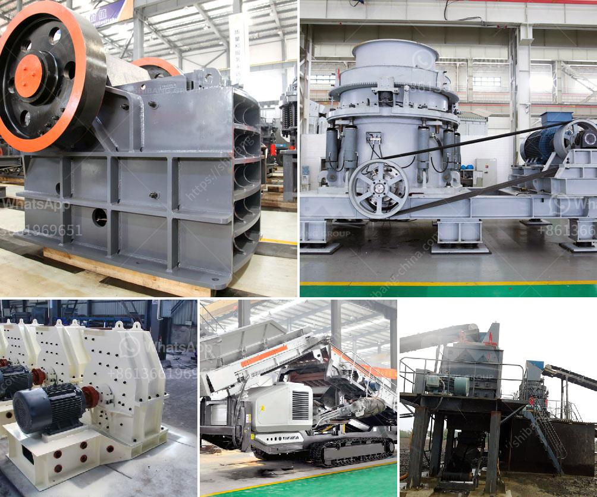

<h3>conveyor belts for buckets</h3>
In the world of industrial automation, efficient material handling is crucial for smooth operations and increased productivity. One ingenious solution that has revolutionized the industry is the conveyor belt for buckets. This innovative system allows for the seamless transportation of materials across various stages, offering numerous benefits and reducing manual effort. 

Firstly, conveyor belts for buckets have greatly simplified the task of moving heavy and bulk materials. Whether it's in mining, construction, agriculture, or any other industry that deals with large quantities of materials, the traditional method of manual handling can be time-consuming, labor-intensive, and prone to human error. With a conveyor belt system, buckets can be attached to a continuous looped belt, providing a streamlined and automated method of material transfer. This results in the significant reduction of manual labor, minimizing the risk of employee fatigue and injury.

Another advantage of bucket conveyor belts is their ability to handle various types of materials, such as sand, gravel, grains, ores, and agricultural products. These belts are designed to withstand heavy loads and harsh environments, ensuring durability and longevity. Additionally, they can be equipped with features like flexible sidewalls, cleats, and dividers to prevent spillage and ensure proper material flow. This versatility makes conveyor belts for buckets an ideal solution for a wide range of industries, allowing for efficient material handling regardless of the size or consistency of the material.

Furthermore, the design and configuration of bucket conveyor belts can be customized to suit specific operations and space constraints. The belts can traverse both horizontal and inclined paths, allowing materials to be transported vertically to different levels or distances. This flexibility enables businesses to optimize their workflow, improve space utilization, and efficiently transfer materials between production processes. Additionally, the speed and direction of the conveyor belt can be easily adjusted, providing further control and adaptability in material handling operations.

One of the crucial advantages of the conveyor belt for buckets is the ability to automate the entire material handling process. By integrating conveyor systems with sensors, programmable logic controllers (PLCs), and other automation technologies, businesses can achieve a seamless flow of materials, reducing the need for constant monitoring and intervention. This automation not only increases efficiency but also minimizes the chance of human error, leading to improved accuracy and productivity.

In conclusion, conveyor belts for buckets offer an efficient and reliable solution for material handling in various industries. These systems provide an automated and streamlined method of moving heavy and bulk materials, significantly reducing manual labor and eliminating potential risks associated with manual handling. The versatility of these belts allows for handling different types of materials, while the customizable design and configuration provide flexibility in adapting to specific operational requirements. Additionally, by integrating automation technologies, businesses can achieve seamless material flow, further enhancing productivity and accuracy. With these significant advantages, it is no wonder that conveyor belts for buckets have become an integral part of modern industrial automation.
<h3>Contact us</h3><ul><li><strong>Whatsapp:&nbsp;<a href="https://wa.me/8613661969651">+8613661969651</a></strong></li><li><a href="https://swt.shibang-china.com/?git&amp;zhl&amp;conveyor belts for buckets"><strong>Online Service(chat now)</strong></a></li></ul><h3>Related</h3><ul><li><a href='grinding or crushing for gypsum pdf.md'>grinding or crushing for gypsum pdf</a></li><li><a href='rock quarrying in cameroon.md'>rock quarrying in cameroon</a></li><li><a href='hammer crusher pc400.md'>hammer crusher pc400</a></li><li><a href='crusher rental companies in oman.md'>crusher rental companies in oman</a></li><li><a href='rock crusher quarry.md'>rock crusher quarry</a></li></ul>