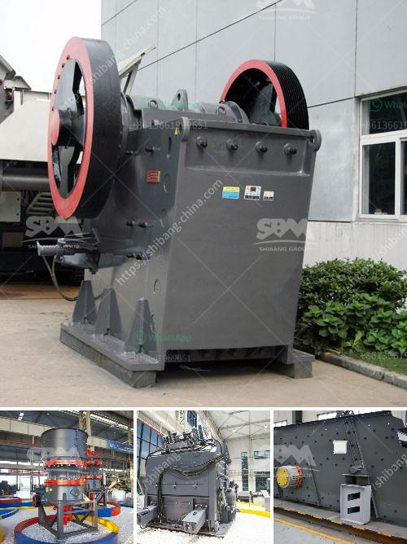

<h3>conveyor belts for mining</h3>
Conveyor belts are an integral part of mining operations. From transporting extracted materials to moving heavy equipment and supplies, conveyor belts play a crucial role in enhancing productivity and efficiency in the mining industry. In this article, we will explore the various applications and benefits of conveyor belts for mining, highlighting their contribution to the sector.

One of the fundamental applications of conveyor belts in mining is the transportation of extracted materials such as coal, ore, and minerals. These materials are often heavy and bulky, making manual transportation challenging and time-consuming. Conveyor belts provide a reliable solution by automating the transportation process, allowing for continuous flow and reducing manual labor.

The efficiency of conveyor belts stems from their ability to handle large quantities of materials over long distances. They can be implemented in both underground and open-pit mining operations, adapting to various terrains and environmental conditions. Conveyor belts ensure a steady and efficient flow of materials, reducing operational downtime and increasing productivity.

Additionally, conveyor belts are essential for moving heavy equipment and supplies within mining sites. This includes transporting drilling machines, excavators, and components necessary for daily operations. By utilizing conveyor belts, mining companies can streamline their logistical processes, minimizing delays and optimizing resource utilization.

Safety is a critical aspect of the mining industry, and conveyor belts contribute significantly to ensuring a secure work environment. Manual handling of heavy materials poses the risk of accidents and injuries. Conveyor belts reduce such risks by automating the transportation process. Moreover, they are designed with safety features such as emergency stop systems and sensors that detect obstructions or misalignments, preventing accidents before they occur.

A key advantage of conveyor belts for mining is their scalability. They can be easily customized to fit specific mining requirements, accommodating varying material types, sizes, and weights. This flexibility allows mining companies to adapt their operations as needed, whether it's increasing output or adjusting to changing material demands. Conveyor belts can be extended or reconfigured to accommodate expansions, ensuring a seamless workflow and optimal resource utilization.

Cost-effectiveness is another significant benefit of conveyor belts for mining. By automating the transportation process, conveyor belts reduce the need for expensive manual labor, minimizing labor costs. Additionally, conveyor belts are durable and require minimal maintenance, making them a cost-effective investment in the long run.

In conclusion, conveyor belts are an essential component of mining operations, providing an efficient and cost-effective solution for material transportation and logistical processes. Their ability to handle heavy materials over long distances, adaptability to various terrains, and contribution to safety make them indispensable in the mining industry. As the sector continues to evolve, conveyor belts will undoubtedly play an increasingly crucial role in driving productivity and efficiency in mining operations.
<h3>Contact us</h3><ul><li><strong>Whatsapp:&nbsp;<a href="https://wa.me/8613661969651">+8613661969651</a></strong></li><li><a href="https://swt.shibang-china.com/?git&amp;zhl&amp;conveyor belts for mining"><strong>Online Service(chat now)</strong></a></li></ul><h3>Related</h3><ul><li><a href='calcium bromide manufacturing process.md'>calcium bromide manufacturing process</a></li><li><a href='mobile iron ore jaw crusher for hire in india.md'>mobile iron ore jaw crusher for hire in india</a></li><li><a href='dolomite refractory processing.md'>dolomite refractory processing</a></li><li><a href='list of cement factories in nepal.md'>list of cement factories in nepal</a></li><li><a href='gypsum calcining equipment price.md'>gypsum calcining equipment price</a></li></ul>