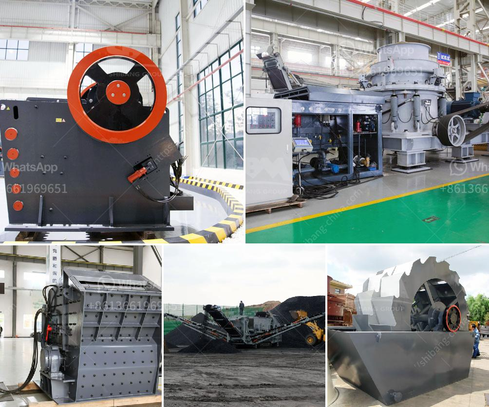

<h3>conveyor belts manufacturers south africa</h3>
Conveyor belts are used in several industries as a convenient method to transport bulk materials or packaged with efficiency, reliability, and safety. Conveyor belts come in different varieties and are utilized in various sectors for different purposes. However, when it comes to conveyor belts manufacturers in South Africa, there are a few leading ones who have excelled in the industry over the years. 

One of the prominent conveyor belts manufacturers in South Africa is Continental Belting Company. Established in 1984, the company has always strived for excellence and has gained a strong foothold in the market. They offer a wide range of conveyor belts catering to various industries such as mining, manufacturing, packaging, and more. Continental Belting Company specializes in producing high-quality conveyor belts that are known for their durability and longevity. 

Another renowned conveyor belts manufacturer in South Africa is Truco. Founded in 1892, Truco has been a pioneer in the industry and has evolved with time to meet the changing needs of its customers. They offer an extensive range of conveyor belts including textile reinforced belts, steel cord belts, chevron belts, heat-resistant belts, and more. Truco is well-known for its commitment to quality and customer satisfaction.

Fenner Dunlop South Africa, a subsidiary of the global Fenner Dunlop Group, is also a prominent player in the conveyor belts market. With over 150 years of experience, Fenner Dunlop South Africa has built a reputation for delivering high-quality conveyor belts and providing excellent customer service. They offer a comprehensive range of conveyor belts for various applications including mining, agriculture, manufacturing, and logistics. Fenner Dunlop South Africa is known for its innovative approach and continuous focus on research and development.

Being a country with a rich mining history, South Africa has a significant demand for conveyor belts. The mining industry, in particular, relies heavily on conveyor belts to transport materials and ores efficiently. Therefore, conveyor belt manufacturers in South Africa cater to this demand and work closely with mining companies to design conveyor belts suitable for mining operations. These belts are designed to handle heavy loads and withstand harsh conditions, making them highly durable and reliable.

Apart from the mining industry, conveyor belts find extensive use in manufacturing plants, food processing facilities, and packaging industries. In manufacturing plants, conveyor belts are used to automate the transportation of goods along assembly lines, enhancing productivity and efficiency. The food processing and packaging industries, on the other hand, require hygienic conveyor belts that prevent contamination and meet strict food safety regulations.

In conclusion, South Africa has a few leading conveyor belts manufacturers who have established themselves in the industry. These manufacturers specialize in producing high-quality conveyor belts that cater to the diverse needs of various industries. The conveyor belts offered by these manufacturers are known for their durability, reliability, and excellent performance. With their commitment to customer satisfaction and continuous focus on innovation, these conveyor belts manufacturers in South Africa are poised to thrive in the market for years to come.
<h3>Contact us</h3><ul><li><strong>Whatsapp:&nbsp;<a href="https://wa.me/8613661969651">+8613661969651</a></strong></li><li><a href="https://swt.shibang-china.com/?git&amp;zhl&amp;conveyor belts manufacturers south africa"><strong>Online Service(chat now)</strong></a></li></ul><h3>Related</h3><ul><li><a href='silica quartz grinding plants bangalore.md'>silica quartz grinding plants bangalore</a></li><li><a href='business plan of processing of calcium carbonate.md'>business plan of processing of calcium carbonate</a></li><li><a href='feldspar crusher equipment.md'>feldspar crusher equipment</a></li><li><a href='crusehr processing plant malaysia.md'>crusehr processing plant malaysia</a></li><li><a href='celestine ball milling process supplier.md'>celestine ball milling process supplier</a></li></ul>