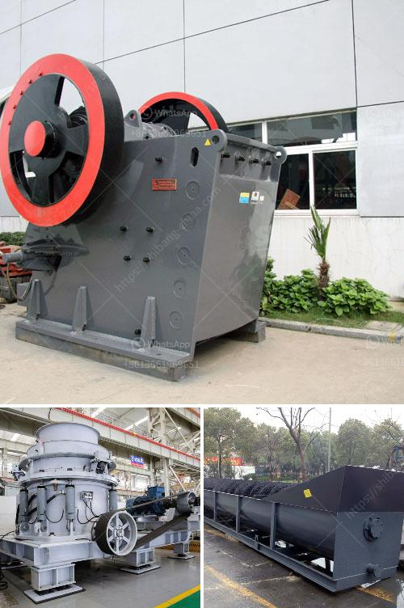

<h3>conveyor belts raw material prices</h3>
Conveyor belts are an integral part of various industries, enabling the transportation of materials and goods from one point to another efficiently and safely. From mining operations to manufacturing plants, these belts play a crucial role in streamlining operations. However, the fluctuation of raw material prices has a significant impact on the production costs and sustainability of conveyor belt manufacturers.

Raw materials used in the manufacturing of conveyor belts include rubber, steel, fabric, and plastic. Each of these materials has its own unique properties that contribute to the overall performance and durability of the belts. However, with the dynamic nature of the global market and geopolitical influences, the prices of these materials can fluctuate dramatically, presenting challenges to manufacturers.

One of the main raw materials used in conveyor belts is rubber, which is derived from both natural and synthetic sources. Natural rubber, extracted from latex harvested from rubber trees, faces price volatility due to several factors such as weather conditions, disease outbreaks, and political instability in major rubber-producing regions like Southeast Asia. Synthetic rubber, derived from petroleum-based chemicals, is also subject to crude oil price fluctuations, making it susceptible to cost variations.

Another critical raw material used in conveyor belts is steel, which is required for the reinforcement of belts, particularly in heavy-duty applications. Steel prices are primarily influenced by global demand and supply dynamics, iron ore prices, and the production capacity of steel mills. Factors such as global economic growth, trade policies, and geopolitical tensions can lead to price volatility in the steel market, impacting conveyor belt manufacturers' production costs.

Fabric, commonly nylon or polyester, is used as the carcass material in conveyor belts, providing strength and flexibility. The prices of these fabrics are influenced by factors such as supply chain disruptions, fluctuations in oil prices (as petroleum products are used in their production), and changes in demand from various industries. Additionally, geopolitical events can impact the availability and cost of raw materials needed for fabric production, further affecting conveyor belt prices.

Plastic materials, including PVC and polyurethane, are also utilized in the production of conveyor belts, particularly for specialized applications. These materials offer advantages such as resistance to chemicals, durability, and flexibility. The prices of plastic raw materials depend on factors such as oil prices, availability of feedstock, and demand from various industries. Moreover, fluctuations in regulations and environmental concerns can also impact the availability and cost of plastic materials, thus affecting conveyor belt manufacturers.

The impact of raw material price fluctuations on conveyor belt manufacturers can be significant. Higher raw material prices often lead to increased production costs, which may either be absorbed by the manufacturers or passed on to the customers through higher prices. In a competitive market, absorbing higher costs may reduce profit margins, while passing on the costs may result in customers seeking more affordable alternatives or postponing investments.

To mitigate the effects of raw material price fluctuations, conveyor belt manufacturers can implement various strategies. These may include establishing long-term contracts with suppliers to secure stable pricing, adopting innovative manufacturing processes to reduce raw material consumption, and investing in research and development to explore alternative materials that offer cost advantages.

In conclusion, the prices of raw materials used in conveyor belts, including rubber, steel, fabric, and plastic, have a significant impact on the production costs and sustainability of manufacturers. Fluctuations in these prices, driven by various factors such as weather conditions, geopolitical events, and global demand dynamics, pose challenges to the industry. To weather these challenges, manufacturers must employ strategies aimed at stabilizing raw material costs, reducing consumption, and exploring alternative materials.
<h3>Contact us</h3><ul><li><strong>Whatsapp:&nbsp;<a href="https://wa.me/8613661969651">+8613661969651</a></strong></li><li><a href="https://swt.shibang-china.com/?git&amp;zhl&amp;conveyor belts raw material prices"><strong>Online Service(chat now)</strong></a></li></ul><h3>Related</h3><ul><li><a href='cement plants for sale.md'>cement plants for sale</a></li><li><a href='gold mining equipment manufacturer china.md'>gold mining equipment manufacturer china</a></li><li><a href='specification of jaw crusher.md'>specification of jaw crusher</a></li><li><a href='100 ton per day cement making plant.md'>100 ton per day cement making plant</a></li><li><a href='how to machine limestone.md'>how to machine limestone</a></li></ul>