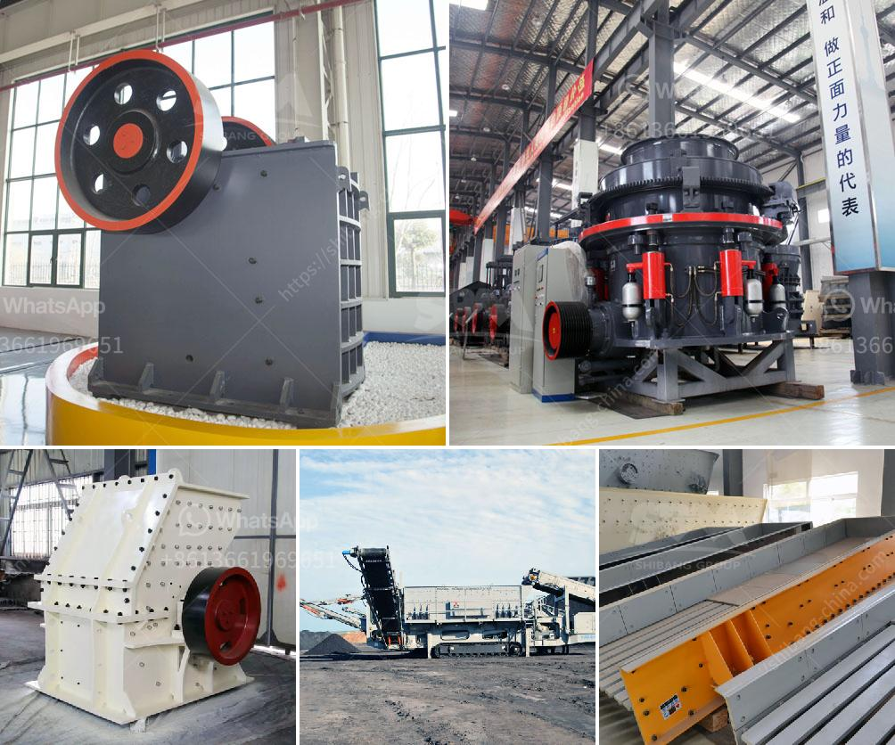

<h3>copper crusher machine</h3>
The copper crusher machine is an essential piece of equipment for any mining or recycling operation. It is used to crush and separate the copper from the surrounding materials. Copper is widely used in various industries due to its excellent electrical conductivity and thermal conductivity, making it a valuable resource.

The copper crusher machine works by compressing the copper material between two rollers, which are driven by a motor. The rollers have sharp, jagged edges that help break down the copper into smaller pieces. As the rollers rotate, the material is squeezed and crushed, separating the copper from the rest of the materials.

One of the main advantages of using a copper crusher machine is its efficiency. It is capable of processing large quantities of copper in a short amount of time. This makes it an ideal choice for mining operations that require a high production rate. Additionally, the machine is designed to minimize energy consumption, making it cost-effective and environmentally friendly.

Another important feature of the copper crusher machine is its durability. The rollers are made of high-quality materials that can withstand the high pressure and friction generated during the crushing process. This ensures that the machine can operate continuously without the need for frequent maintenance or repairs.

Furthermore, the copper crusher machine is highly versatile. It can be easily integrated into existing production lines or used as a standalone unit. Its compact size allows for easy transportation and installation in different locations. Additionally, the machine can be adjusted to produce copper of different sizes and specifications, depending on the requirements of the application.

In conclusion, the copper crusher machine is a valuable tool for mining and recycling operations. Its efficiency, durability, and versatility make it an essential piece of equipment for any industry that deals with copper. Whether it is used for mining purposes or recycling copper scrap, this machine is a cost-effective and reliable solution to process copper efficiently.
<h3>Contact us</h3><ul><li><strong>Whatsapp:&nbsp;<a href="https://wa.me/8613661969651">+8613661969651</a></strong></li><li><a href="https://swt.shibang-china.com/?git&amp;zhl&amp;copper crusher machine"><strong>Online Service(chat now)</strong></a></li></ul><h3>Related</h3><ul><li><a href='gold wash plant trummel revelstoke.md'>gold wash plant trummel revelstoke</a></li><li><a href='cement plants for sale.md'>cement plants for sale</a></li><li><a href='hammer mill size reduction.md'>hammer mill size reduction</a></li><li><a href='rotary kiln cement plant cost in india.md'>rotary kiln cement plant cost in india</a></li><li><a href='conveyor belt manufacturers in bangladesh.md'>conveyor belt manufacturers in bangladesh</a></li></ul>