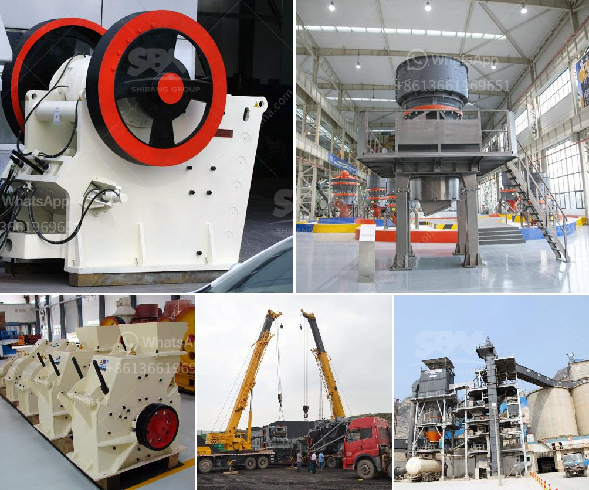

<h3>copper making process</h3>
Copper is a versatile metal that has been used for various purposes for thousands of years. From electrical wiring to plumbing and decorative elements, copper is an essential material in many industries. However, not many people are aware of how copper is made and the intricacies involved in its production process.

The copper making process begins with the extraction of copper ore from underground or open-pit mines. The ore is then crushed and ground into a fine powder. This powdered ore undergoes a series of chemical reactions to separate copper from other elements present in the ore.

The first step in the copper making process is known as flotation. In this stage, the powdered ore is mixed with water and chemicals, including a foaming agent. Air is then bubbled through the mixture, causing copper minerals to attach to air bubbles and float to the surface. This forms a froth, which is collected and further processed.

The froth undergoes a process called smelting, where it is heated at high temperatures in a smelter furnace. This step helps remove impurities and further concentrates the copper content. The resulting molten copper, known as blister copper, is then cast into anodes.

The anodes are placed in an electrolytic cell, immersed in a copper sulfate solution. A direct electric current is passed through the cell, causing copper ions to move towards the cathode, where they are deposited as pure copper metal. This process, known as electrorefining, ensures the production of high-grade copper.

Once the copper is refined, it can be shaped and utilized for various applications. It can be rolled into sheets or drawn into wires, depending on the intended use. The finished copper products undergo quality checks to ensure that they meet industry standards before being distributed to consumers.

The copper making process is complex and requires careful attention to detail. It involves a combination of physical and chemical processes to obtain pure copper from its ore. Environmental considerations, such as proper waste management and energy usage, are crucial aspects of copper production, as the industry strives to minimize its impact on the planet.

In conclusion, copper production involves a series of steps, starting from the extraction of copper ore to the final finishing of the metal. The process includes flotation, smelting, electrorefining, and shaping, ensuring the production of high-quality copper that can be used in various applications. With its remarkable properties and versatility, copper continues to play a vital role in our daily lives.
<h3>Contact us</h3><ul><li><strong>Whatsapp:&nbsp;<a href="https://wa.me/8613661969651">+8613661969651</a></strong></li><li><a href="https://swt.shibang-china.com/?git&amp;zhl&amp;copper making process"><strong>Online Service(chat now)</strong></a></li></ul><h3>Related</h3><ul><li><a href='prices of vibrating screens.md'>prices of vibrating screens</a></li><li><a href='horizontal impact crusher for sale.md'>horizontal impact crusher for sale</a></li><li><a href='turkey plant production line of gypsum powder.md'>turkey plant production line of gypsum powder</a></li><li><a href='crusher machine price in pakistan.md'>crusher machine price in pakistan</a></li><li><a href='prices of sodium carbonate crushers.md'>prices of sodium carbonate crushers</a></li></ul>