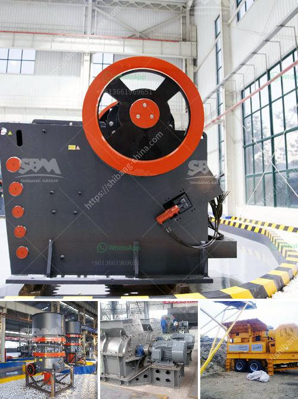

<h3>copper mining and crusher processing in zambia</h3>
Copper mining is a prominent industry in Zambia, which boasts a rich mineral resource base and has been attracting global attention for decades. Mining companies operating in the country are primarily involved in the extraction and processing of copper, with some of them also mining other resources such as cobalt, gold, and nickel.

Zambia is globally recognized as a major producer of copper, and the metal accounts for a significant portion of the country's export earnings. The mining sector contributes significantly to Zambia's GDP, providing employment opportunities and driving economic growth. As a result, copper mining has played a crucial role in the development of the nation's infrastructure and social programs.

The process of copper mining begins with drilling and blasting, which involves the use of explosives to break up the hard rock. Once the ore is blasted, it is transported to a primary crusher, where it is crushed into smaller particles. The crushed ore is then sent to a secondary crusher for further size reduction before it is conveyed to the grinding circuit.

In the grinding circuit, the ore is ground into a fine powder, which is then mixed with water and chemicals to form a slurry. This slurry is fed into flotation cells, where the copper minerals attach to air bubbles and float to the surface as a froth. The froth, containing about 30% copper, is skimmed off and dried to produce copper concentrate.

Zambia's copper concentrate is typically shipped to smelters around the world for further processing. Smelting involves the extraction of copper from the concentrate through a series of chemical and heat treatments. The end result is blister copper, which is about 98% pure and can be further refined to achieve higher purity levels.

The mining industry in Zambia has faced numerous challenges over the years, including fluctuating commodity prices, inadequate infrastructure, and regulatory issues. However, the government has taken steps to address these challenges and attract more investment in the sector. In recent years, there has been a renewed focus on promoting local beneficiation and value addition to maximize the benefits of the country's mineral resources.

One positive example of this is the establishment of copper smelters in Zambia, such as the Kansanshi and Mopani smelters. These facilities have helped to increase the value of Zambia's copper exports by processing the concentrate domestically, creating jobs, and reducing reliance on foreign smelters.

However, the mining industry in Zambia still faces several sustainability challenges, including the impact on the environment and local communities. Efforts are being made by mining companies to mitigate these impacts through initiatives such as community development programs, environmental monitoring, and rehabilitation of mined-out areas.

In conclusion, copper mining and crusher processing are vital components of the Zambian economy and the mining sector is the mainstay of the country's socio-economic development. As a leading copper producer, Zambia has a responsibility to maximize the sustainable benefits of its mineral resources while minimizing any negative impacts. Through ongoing investments and responsible mining practices, Zambia can continue to be a global leader in the copper industry.
<h3>Contact us</h3><ul><li><strong>Whatsapp:&nbsp;<a href="https://wa.me/8613661969651">+8613661969651</a></strong></li><li><a href="https://swt.shibang-china.com/?git&amp;zhl&amp;copper mining and crusher processing in zambia"><strong>Online Service(chat now)</strong></a></li></ul><h3>Related</h3><ul><li><a href='copper powder making machine.md'>copper powder making machine</a></li><li><a href='cement grinding plant layout.md'>cement grinding plant layout</a></li><li><a href='crusher chromite sand buyers china.md'>crusher chromite sand buyers china</a></li><li><a href='crushing and serreing machinery.md'>crushing and serreing machinery</a></li><li><a href='silica sand price per tonne.md'>silica sand price per tonne</a></li></ul>