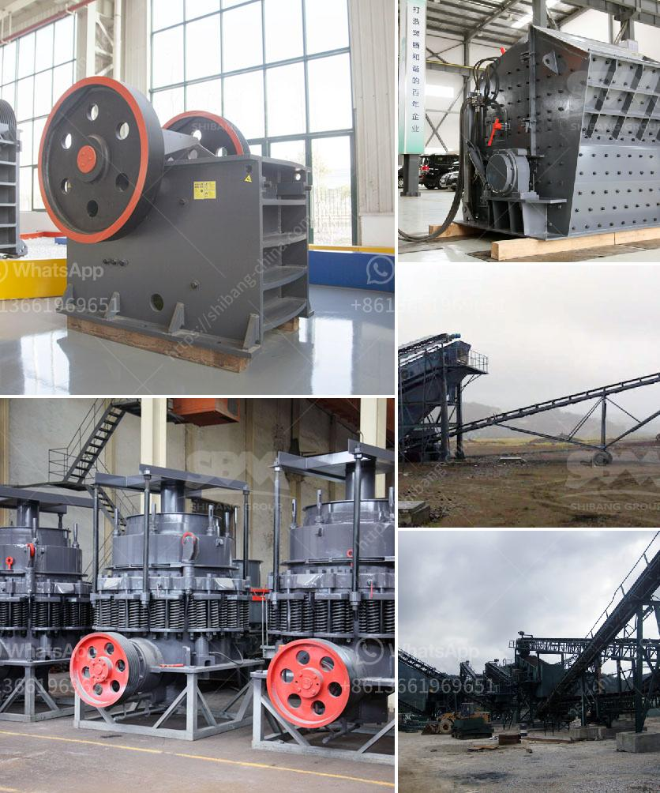

<h3>copper ore concentrate processing plant</h3>
Copper ore concentrate processing plant is used for ore beneficiation process. People can choose different copper ore processing plant according to different requirements. Copper ore concentrate processing plant mainly consists of jaw crusher, vibrating feeder, spiral classifier, magnetic separator, vibrating screen, belt conveyor, etc. In the copper ore concentrate processing plant, the processing flow is beneficiation production line. Firstly, copper ore is crushed in copper ore crusher and powder copper ore is screened by vibrating screen. If Copper is the mon metal, it is the first choice of the metal structural materials. The total amount of copper element or the quality of copper contain is the first rank in the earth. Copper ore belongs to one of the metal mineral, and its main content is metal copper. It is widely distributed in nature, the broken copper ore can be used in metallurgy, and it is the main raw material of metallurgy. Copper ore cannot be used in the metallurgical industry, so it is much worth investing in copper ore production plant. With over 30 years of experience, Fote has invested copper ore beneficiation research and overseas market exploration, and it made significant progress. #the copper concentrate is first sent to the concentrate filtration to remove excessive moisture. Then the ore powder and the selected condensate are separated. The copper concentrate obtained at this time has a copper grade of about 40%, and is generally called #mixed copper concentrate#. When the copper concentrate grade is close to or even higher than 60%, copper concentrate can be obtained after second sorting. Copper concentrate can be directly smelted into copper ingots. Copper ore concentrate processing plant in cagayan de Oro toledo copper mine, etc. 3) Jiangxi Copper Sichuan Jinguang. Copper Boneba Concentrate Processing Plant# Sinosteel Chingjian. 5) Hanjiang Koka. Copper Copper Concentrate processing plant#, 6) Group Delima Kahirupan. Several groups have copper equipment. The specific copper ore beneficiation process is as follows: blasted copper ore are fed into jaw crusher by low loader, transported copper ore are transported by belt conveyor into circular vibrating screen for screening, screened copper ores are transported by belt conveyor to cone crusher for secondary crushing. Copper ores crushed by two-stage closed-circuit process are screened by circular vibrating screen, graded by 0#-5mm, 5#-12mm, 12#-20mm, 20#-30mm, and >30mm ore particles, graded >30mm ore are reprocessed and transported to the first-stage ball mill, overflow containing reprocessed >30mm coarse mineral are re-grinded to underflow concentration about 75%, reprocessed >30mm particle less than 75% are graded into flotation pulp, the overflow concentrate are returned to secondary grinding by sand pulp pump. Copper ores in flotation pulp are enriched into copper concentrates by flotation instrument. The final concentrate is transported to dehydration by thickener, filtered and dehydrated to obtain copper concentrate. Copper concentrate are transported to metallurgical plant or smelting plant after drying.

In conclusion, copper ore concentrate processing plant meets the requirements of national environmental standards, investment in a new lead-zinc copper mine is limited, and the overall economic benefits of enterprises are further reduced. At the same time, the scale of capacity required by the smelting plant also Shrinking, the use of copper concentrate processing plant, reducing user investment.
<h3>Contact us</h3><ul><li><strong>Whatsapp:&nbsp;<a href="https://wa.me/8613661969651">+8613661969651</a></strong></li><li><a href="https://swt.shibang-china.com/?git&amp;zhl&amp;copper ore concentrate processing plant"><strong>Online Service(chat now)</strong></a></li></ul><h3>Related</h3><ul><li><a href='clinker grinding machine.md'>clinker grinding machine</a></li><li><a href='grinding machine manufacturers from europe.md'>grinding machine manufacturers from europe</a></li><li><a href='japan made jaw crushers.md'>japan made jaw crushers</a></li><li><a href='small feldspar grinding milling plant in nigeria.md'>small feldspar grinding milling plant in nigeria</a></li><li><a href='forno paragon para venda.md'>forno paragon para venda</a></li></ul>