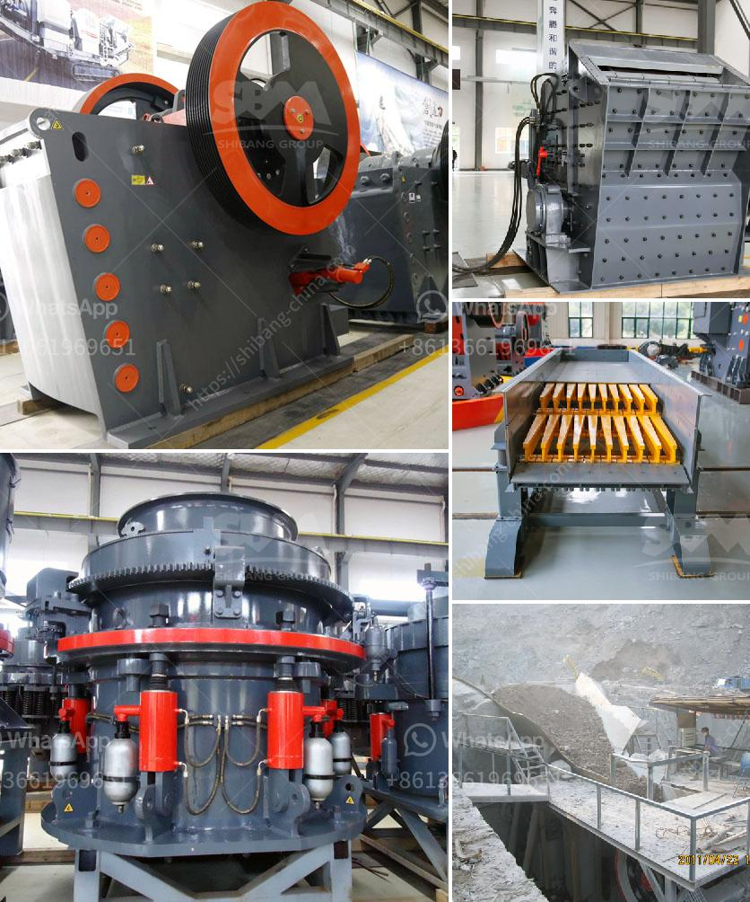

<h3>copper powder making machine</h3>
Copper powder is a versatile material extensively used in various industries, including electronics, construction, and automotive. Its wide range of applications demands cost-effective and precise manufacturing processes, which have now been made possible through the advancements in copper powder making machines. These machines have revolutionized the manufacturing industry by streamlining the production of copper powder and enhancing its quality and consistency.

One significant advantage of copper powder making machines is their ability to efficiently convert raw copper materials into fine, high-quality powder. The process starts with the copper materials being crushed and ground into smaller particles. These particles are then mixed with specific chemicals, depending on the desired grain size and purity of the final product. The mixture is then fed into the copper powder making machine, where it undergoes a series of mechanical and chemical processes to form the desired copper powder.

The mechanical processes involved in copper powder making machines are crucial for achieving the desired particle size and shape. These machines are equipped with advanced grinding and crushing mechanisms that allow for precise control over the powder's consistency. The copper materials are subjected to intense forces and pressure, which break them down into smaller particles. This results in a more uniform and consistent copper powder that meets industry standards.

Apart from the mechanical processes, copper powder making machines also utilize chemical reactions to enhance the purity and quality of the final product. The addition of specific chemicals during the manufacturing process helps remove impurities and contaminants from the copper materials. This ensures that the resulting copper powder is free from any unwanted elements, making it suitable for a wide range of applications.

The automation and control systems integrated into copper powder making machines are another reason for their revolutionizing impact on the manufacturing industry. These machines are equipped with advanced sensors and monitoring devices that allow for real-time monitoring and adjustment of various parameters, such as temperature, pressure, and particle size control. This level of automation ensures consistent quality and minimizes human error, leading to increased production efficiency and reduced production costs.

Furthermore, copper powder making machines are designed to be environmentally friendly. They often incorporate advanced dust collection systems that minimize the release of copper particles into the air during the manufacturing process. Additionally, the machines are energy-efficient, helping reduce overall energy consumption and carbon emissions.

In conclusion, copper powder making machines have revolutionized the manufacturing industry by providing an efficient and cost-effective solution for producing high-quality copper powder. Their advanced mechanical and chemical processes, coupled with automation and control systems, enable precise control over particle size, shape, and purity. These machines have not only enhanced the production efficiency but have also contributed to the environmental sustainability of the copper powder manufacturing process. With the continued advancements in technology, copper powder making machines are expected to further streamline the production process, thereby meeting the ever-growing demands of various industries for this versatile material.
<h3>Contact us</h3><ul><li><strong>Whatsapp:&nbsp;<a href="https://wa.me/8613661969651">+8613661969651</a></strong></li><li><a href="https://swt.shibang-china.com/?git&amp;zhl&amp;copper powder making machine"><strong>Online Service(chat now)</strong></a></li></ul><h3>Related</h3><ul><li><a href='how to make silica rock pebles in ball mill.md'>how to make silica rock pebles in ball mill</a></li><li><a href='vertical horizontal milling machine.md'>vertical horizontal milling machine</a></li><li><a href='price for vsi crusher.md'>price for vsi crusher</a></li><li><a href='roller mill from china.md'>roller mill from china</a></li><li><a href='barite crusher machine.md'>barite crusher machine</a></li></ul>