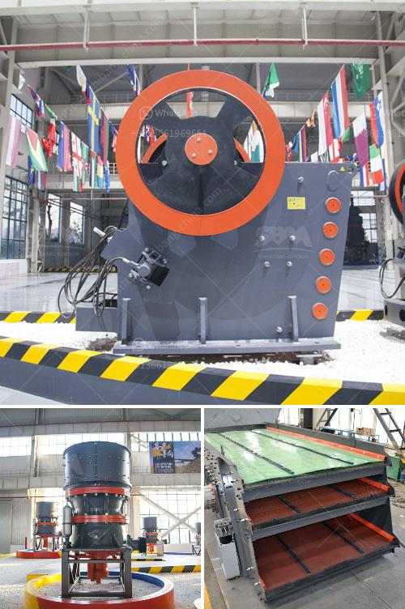

<h3>copper processing plants in usa for sale</h3>
Copper is one of the most widely used metals in various industries, known for its excellent conductivity and corrosion resistance. As a result, the demand for copper continues to rise, creating opportunities for copper processing plants in the USA.

Copper processing plants play a crucial role in ensuring the supply of refined copper for various applications, including electrical wiring, plumbing, and telecommunications. These plants extract copper from its ores and refine it to meet industry specifications. With advancements in technology and increasing demand, the copper processing industry has witnessed significant growth.

In the USA, there are several copper processing plants available for sale to meet the market demand. These plants are equipped with state-of-the-art machinery and equipment to ensure efficient extraction and refining processes. The main steps involved in copper processing include:

1. Mining: Copper ores are extracted from underground or open-pit mines. These ores typically contain trace amounts of valuable metals such as gold and silver, making the mining process economically viable.

2. Crushing and Grinding: After the ores are extracted, they are crushed into smaller pieces and then ground into a fine powder. This process increases the surface area of the ore, allowing for more efficient chemical reactions.

3. Froth Flotation: The powdered ore is mixed with water and chemicals such as collectors and frothers. The mixture is then agitated, and air bubbles are introduced. These air bubbles attach themselves to the copper minerals, separating them from the unwanted rock and minerals.

4. Smelting and Converting: The concentrated copper minerals are then smelted in high-temperature furnaces to remove impurities and obtain pure copper. The molten copper is further refined through converting processes, which remove any remaining impurities and adjust the composition of the final product.

5. Electrorefining: The refined copper is subjected to electrorefining to further purify it and improve its conductivity. This process involves passing an electric current through the copper, causing impurities to migrate to the anode, leaving behind pure copper at the cathode.

Copper processing plants for sale in the USA offer investors an excellent opportunity to enter the lucrative copper market. These plants are equipped with advanced technology and machinery, enabling efficient operations and high-quality copper production. The availability of such plants provides a streamlined solution for businesses looking to establish or expand their presence in the copper industry.

Additionally, purchasing an existing copper processing plant offers several advantages over starting a new plant from scratch. These advantages include reduced setup time, access to an established customer base, and a smoother transition into a fully operational facility. Experienced staff and management already familiar with the plant's operations can also provide crucial support during the transition period.

In conclusion, the demand for copper in various industries continues to rise, leading to increased opportunities in the copper processing sector. With advanced technology and machinery, copper processing plants in the USA offer a lucrative investment option. By acquiring an existing plant, businesses can quickly enter the copper market and benefit from an established infrastructure.
<h3>Contact us</h3><ul><li><strong>Whatsapp:&nbsp;<a href="https://wa.me/8613661969651">+8613661969651</a></strong></li><li><a href="https://swt.shibang-china.com/?git&amp;zhl&amp;copper processing plants in usa for sale"><strong>Online Service(chat now)</strong></a></li></ul><h3>Related</h3><ul><li><a href='sand washing screener florida.md'>sand washing screener florida</a></li><li><a href='blast slag grinding machine india.md'>blast slag grinding machine india</a></li><li><a href='automated roller conveyors.md'>automated roller conveyors</a></li><li><a href='how to design iron ore plant.md'>how to design iron ore plant</a></li><li><a href='india 200 tpd cement plant cost.md'>india 200 tpd cement plant cost</a></li></ul>