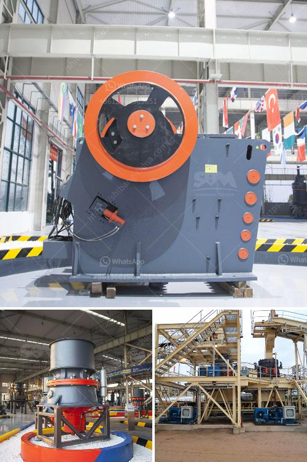

<h3>copper slag recycling plants china</h3>
Copper slag is a by-product of copper extraction and refining processes. It is commonly used as an abrasive material in sand blasting and surface cleaning. However, due to its high content of valuable elements such as copper and iron, copper slag has become an important industrial resource that can be recycled and reused.

China is one of the largest consumers of copper and copper slag in the world. As a result, the country has a significant number of copper slag recycling plants. These plants are equipped with advanced technology and machinery to efficiently extract copper and other valuable elements from the slag.

The recycling process starts with the collection and transportation of copper slag from various industries such as smelters, refineries, and construction sites. The slag is then crushed, sieved, and sorted to remove impurities, such as rocks and debris. After that, it undergoes a series of physical and chemical processes to recover copper and other valuable elements.

One of the commonly used methods for copper recovery is flotation. In this process, the copper slag is mixed with water and chemicals to create a slurry. Air bubbles are then introduced, which attach themselves to the copper particles, causing them to float to the surface. These floating copper particles are skimmed off and collected for further processing and refining.

Besides copper, the recycling plants in China also extract and recover other valuable elements from the slag, such as iron, zinc, lead, and even precious metals like gold and silver. These recovered materials are then sold to various industries for further use or refinement.

The recycling of copper slag not only helps in conserving natural resources but also reduces the environmental impact associated with the disposal of this waste material. By recycling copper slag, less mining of copper ore is required, thus preserving valuable non-renewable resources. Moreover, the recycling process also reduces the emissions of greenhouse gases and other pollutants that are released during the extraction and refining of copper from raw ores.

In addition, copper slag recycling plants in China provide employment opportunities for many people. These plants require skilled workers, engineers, technicians, and other professionals to operate, maintain, and manage the recycling processes. By creating jobs, these recycling plants contribute to the economic development of the regions where they are located.

To further promote the recycling of copper slag, the Chinese government has introduced policies and incentives to encourage industries to recycle this waste material. These include tax incentives, subsidies for equipment and machinery, and research and development support for improving recycling technologies.

In conclusion, copper slag recycling plants in China play a crucial role in the recovery and reuse of valuable elements from industrial waste. These plants efficiently extract copper and other valuable elements from the slag and reduce the reliance on mining of raw ores. The recycling process also helps in reducing environmental impact and creates employment opportunities. With the support of government policies and incentives, the recycling of copper slag is expected to continue to grow in China in the coming years.
<h3>Contact us</h3><ul><li><strong>Whatsapp:&nbsp;<a href="https://wa.me/8613661969651">+8613661969651</a></strong></li><li><a href="https://swt.shibang-china.com/?git&amp;zhl&amp;copper slag recycling plants china"><strong>Online Service(chat now)</strong></a></li></ul><h3>Related</h3><ul><li><a href='small scale mining equipment price in zimbabwe.md'>small scale mining equipment price in zimbabwe</a></li><li><a href='pulviriser machine in allahabad.md'>pulviriser machine in allahabad</a></li><li><a href='material ball mills.md'>material ball mills</a></li><li><a href='picture of concrete crusher machine.md'>picture of concrete crusher machine</a></li><li><a href='sample business plan for stone crusher pdf.md'>sample business plan for stone crusher pdf</a></li></ul>