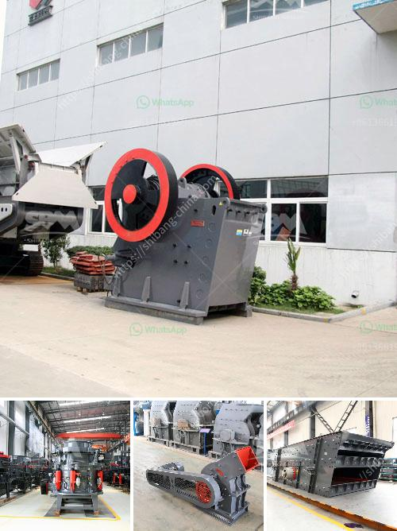

<h3>cost effective small mobilized jaw crusher</h3>
Small mobilized jaw crusher is suitable for small-scale mining or construction projects. This machine has limited power and size, making it ideal for small and medium-scale operations. Its compact size allows it to be easily transported and maneuvered, making it perfect for on-site crushing. Additionally, its cost-effectiveness makes it an excellent choice for budget-conscious projects.

One of the primary advantages of a small mobilized jaw crusher is its portability. It can be easily transported to different sites, eliminating the need for multiple machines or crushing equipment. This not only saves time and effort but also reduces transportation costs. With its compact design, it can be easily loaded onto a trailer or truck, enabling efficient transportation from one location to another.

Another benefit of a small mobilized jaw crusher is its cost-effectiveness. These machines are generally more affordable compared to larger crushers. They often have a lower initial investment cost and require less maintenance and repair. This makes them an attractive option for small and medium-scale operations with limited budgets. By choosing a small mobilized jaw crusher, operators can save money without compromising on quality or performance.

Despite its smaller size, a small mobilized jaw crusher can still deliver efficient and reliable crushing results. These machines are equipped with a powerful jaw crusher that can break down various types of materials, including concrete, stone, and asphalt. The crushing chamber is designed to maximize productivity while minimizing energy consumption. The adjustable settings allow operators to adjust the output size of the crushed material, further enhancing its versatility and performance.

In addition to its crushing capabilities, a small mobilized jaw crusher also offers ease of operation. These machines are typically equipped with user-friendly controls and interfaces, making them easy to operate even for operators with minimal experience. Clear instructions and safety features ensure that operators can work safely and efficiently.

When considering purchasing a small mobilized jaw crusher, it is important to analyze your specific needs and requirements. Consider the type and size of the materials you need to crush, as well as the expected output rate. By understanding your project's needs, you can make an informed decision and choose the right machine for your operation.

In conclusion, a cost-effective small mobilized jaw crusher is an excellent option for small and medium-scale operations. Its compact size, portability, affordability, and efficient performance make it a valuable asset for on-site crushing. By investing in this machine, operators can save money, time, and effort while achieving reliable and high-quality crushing results. Make sure to carefully assess your specific needs and requirements to choose the right model that meets your project's demands.
<h3>Contact us</h3><ul><li><strong>Whatsapp:&nbsp;<a href="https://wa.me/8613661969651">+8613661969651</a></strong></li><li><a href="https://swt.shibang-china.com/?git&amp;zhl&amp;cost effective small mobilized jaw crusher"><strong>Online Service(chat now)</strong></a></li></ul><h3>Related</h3><ul><li><a href='granite machine manufacturer india.md'>granite machine manufacturer india</a></li><li><a href='manganese mining techniques.md'>manganese mining techniques</a></li><li><a href='calcium carbonate factory costs.md'>calcium carbonate factory costs</a></li><li><a href='stone crusher machine manufacturer germany.md'>stone crusher machine manufacturer germany</a></li><li><a href='hammer mill prices in zimbabwe.md'>hammer mill prices in zimbabwe</a></li></ul>