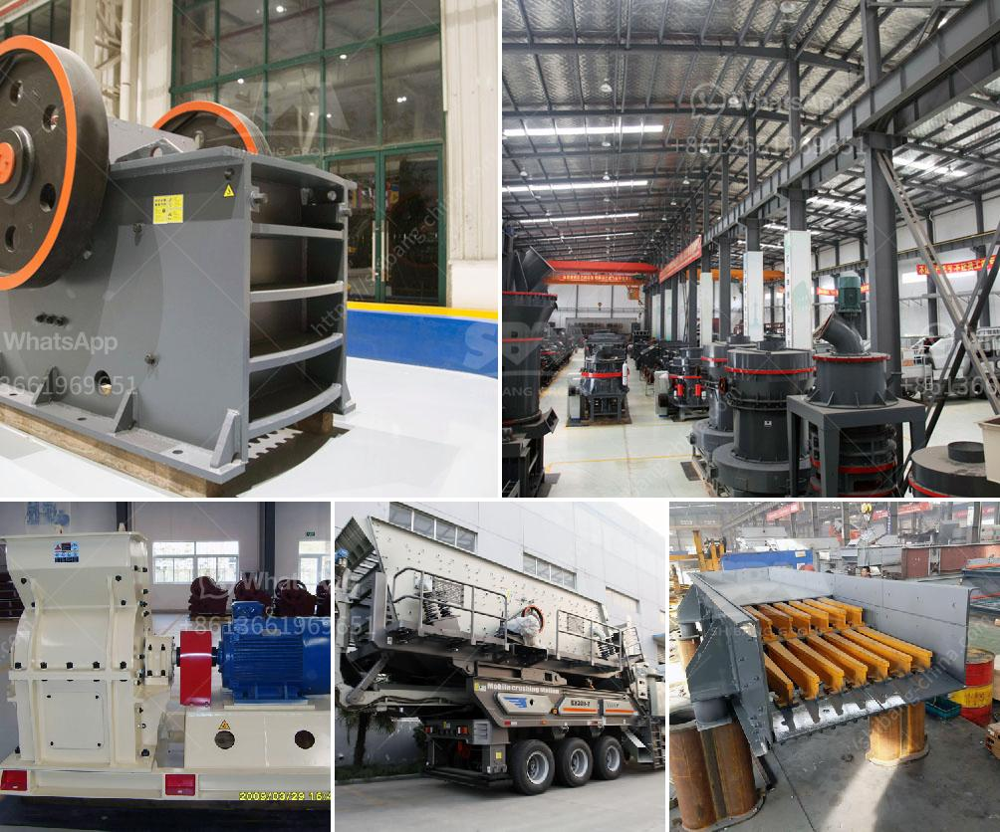

<h3>cost gypsum processing machines</h3>
Gypsum is a mineral abundant in nature and is predominantly used for making plaster of Paris and other construction materials. The process of extracting gypsum can be challenging, requiring the use of heavy machinery. It is essential to understand the cost implications of procuring these machines to ensure efficient and cost-effective operations.

The cost of gypsum processing machines varies depending on several factors, such as the type and capacity of the machines, the location of the manufacturer, and any additional features or customization options. Generally, the cost range for gypsum processing machines can vary from a few hundred thousand dollars to several million dollars.

One of the primary factors impacting the cost is the machinery's capacity. Higher-capacity machines typically cost more. The capacity needed for gypsum processing machines will depend on various factors, such as the scale of operations and the intended end-use of the gypsum product. For example, a large construction company producing gypsum boards on a large scale may require high-capacity machines compared to a smaller company focusing on smaller batches.

The location of the manufacturer also affects the cost of gypsum processing machines. Different countries have varying labor and material costs, which can be reflected in the machine's price. For example, machines manufactured in low-cost labor regions may have a lower price tag compared to machines produced in countries with higher labor costs. However, it is important to consider factors beyond the initial cost, such as quality, support, and availability of spare parts, to make an informed decision.

Optional features and customization options can also impact the cost of gypsum processing machines. Some machines may come with additional functionalities or automation features that enhance efficiency and productivity. While these can increase the upfront cost, they may result in significant long-term savings through improved productivity and reduced labor requirements.

Maintenance and operational costs should also be factored into the overall cost of gypsum processing machines. Regular maintenance and occasional repairs are crucial to ensure smooth operations and maximize the lifespan of the equipment. Therefore, it is essential to consider the availability of spare parts and the reputation of the manufacturer for after-sales support. Choosing a machine with high durability and reliability can help minimize the long-term maintenance costs.

It is advisable to obtain multiple quotes from different manufacturers to compare the costs and features of gypsum processing machines to find the best fit for specific business requirements. It is also important to consider factors beyond cost, such as the reputation, customer reviews, and warranty offered by the manufacturer.

In conclusion, the cost of gypsum processing machines can vary depending on factors such as capacity, location of the manufacturer, optional features, and maintenance requirements. It is crucial to carefully evaluate these factors and consider long-term benefits to make a cost-effective investment in gypsum processing machinery. By conducting thorough research and obtaining quotes from multiple manufacturers, businesses can find the right machines that meet their requirements within their budget.
<h3>Contact us</h3><ul><li><strong>Whatsapp:&nbsp;<a href="https://wa.me/8613661969651">+8613661969651</a></strong></li><li><a href="https://swt.shibang-china.com/?git&amp;zhl&amp;cost gypsum processing machines"><strong>Online Service(chat now)</strong></a></li></ul><h3>Related</h3><ul><li><a href='business plan for small scale chrome mining crusher.md'>business plan for small scale chrome mining crusher</a></li><li><a href='cost of the project for 100 tph stone crushing unit.md'>cost of the project for 100 tph stone crushing unit</a></li><li><a href='river sand and stone mining at sabah.md'>river sand and stone mining at sabah</a></li><li><a href='philippines cone crusher.md'>philippines cone crusher</a></li><li><a href='deasel stone crushers and prices in gauteng.md'>deasel stone crushers and prices in gauteng</a></li></ul>