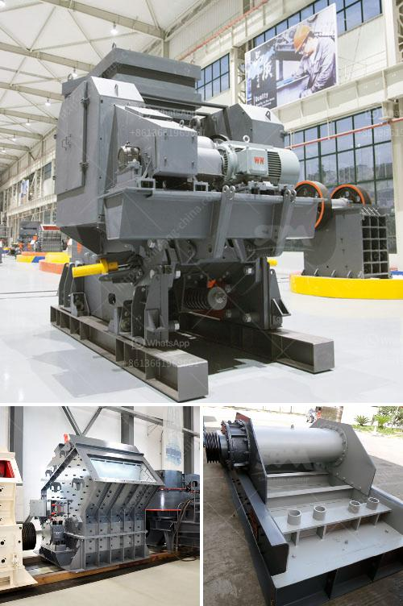

<h3>cost of ball mill in india</h3>
We all know that the price of grinding equipment in India is high. Ball mill is one of the most widely used grinding equipment in India. Due to its wide application, simple structure and convenient maintenance, ball mill is favored by investors. However, with the increase of market competition, the cost of ball mill in India also continues to increase. To save your investment cost, you should choose the suitable ball mill for your production line.

1. The specifications of ball mill: the most obvious factor affecting the price of ball mill is its specifications. Different specifications mean different prices. For example, the price of large-scale ball mill with diameter of 5m and length of 15m is much higher than that of small ball mill with diameter of 1.5m and length of 4m.

2. Production capacity: the higher the production capacity of ball mill, the higher the price. Generally speaking, the production capacity of ball mill can reach hundreds of tons per hour or even thousands of tons per hour. If the production capacity you need is relatively small, you can choose a smaller model, which can effectively reduce the cost.

3. Material of ball mill: the material of ball mill directly affects its service life and production efficiency. Different materials have different prices. For example, the price of ball mill made of ordinary steel is lower than that of ball mill made of stainless steel or alloy steel.

4. Manufacturer: ball mill produced by different manufacturers has different prices. Some large-scale and well-known manufacturers have higher prices than small manufacturers. However, the ball mill produced by large-scale manufacturers is generally of better quality and more reliable performance.

The cost of ball mill in India is also affected by the regional consumption level. For example, the price of ball mill in Maharashtra, Tamil Nadu and Delhi is relatively high, while the price of ball mill in Gujarat, Karnataka and Orissa is relatively low.

The cost of ball mill in India contributes a lot to the overall cost of ball mill production. Therefore, the choice of ball mill machine should be considered carefully. It is very important to select suitable ball mill based on mineral properties and production requirements. SBM is a professional ball mill manufacturer from China and the ball mill machine from this company is divided into 24 different models. Each of ball mills has different specifications and suitable for different materials. Choose the suitable ball mill machine for your production line will help you save your investment cost.
<h3>Contact us</h3><ul><li><strong>Whatsapp:&nbsp;<a href="https://wa.me/8613661969651">+8613661969651</a></strong></li><li><a href="https://swt.shibang-china.com/?git&amp;zhl&amp;cost of ball mill in india"><strong>Online Service(chat now)</strong></a></li></ul><h3>Related</h3><ul><li><a href='buy mobile crusher.md'>buy mobile crusher</a></li><li><a href='prices stone crusher machine.md'>prices stone crusher machine</a></li><li><a href='copper mining and crusher processing in zambia.md'>copper mining and crusher processing in zambia</a></li><li><a href='hammer mill nigeria.md'>hammer mill nigeria</a></li><li><a href='conveyor belts manufacturers south africa.md'>conveyor belts manufacturers south africa</a></li></ul>