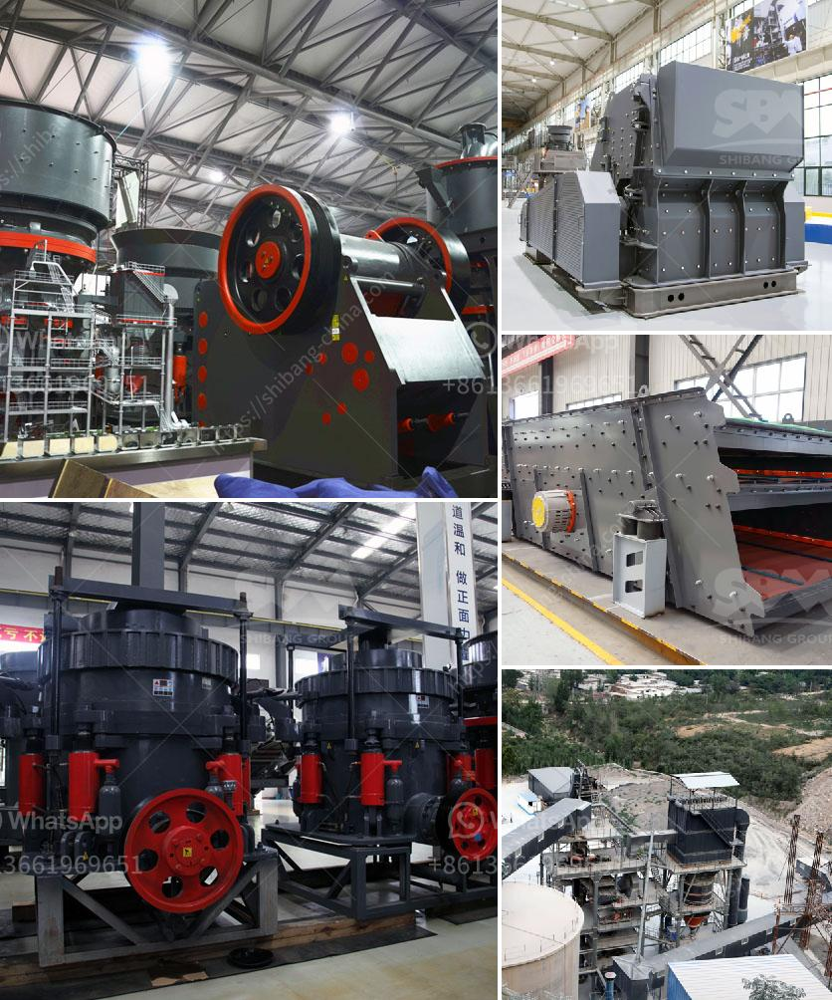

<h3>cost of cement grinding unit in india</h3>
The cement industry is one of the fastest-growing sectors in India. Cement is a vital ingredient for the construction industry and plays an essential role in the country's infrastructure development. With the increasing demand for cement, new cement plants are being established to cater to this demand.

One significant aspect of cement production is grinding clinker into cement. Grinding is the final process in cement production, where clinker is crushed into smaller particles and mixed with additives to produce the final cement product. The cost of cement grinding is a key factor that influences the overall cost of cement production.

The cost of a cement grinding unit can vary widely depending on factors like the type of cement, the grinding process used, and the efficiency of the particular unit. The grinding units are set up closer to consumption centers to reduce transportation costs. This allows cement manufacturers to cater to local demand effectively and reduces the overall cost of transportation.

The cost of setting up a cement grinding unit in India can range from around Rs. 5 Crore to Rs. 15 Crore, depending on the size and location of the unit. The grinding unit is typically located near to the cement manufacturing plant to minimize transportation costs. The clinker grinding unit is generally a standalone unit that is fed with clinker from the cement plant and gypsum from external sources.

There are various types of grinding systems available for cement grinding. These include ball mills, roller press with ball mills, vertical roller mills, and a combination of these systems. Each system has its own advantages and disadvantages in terms of energy consumption, maintenance, and cost.

Ball mills are the most commonly used grinding equipment in cement plants due to their simplicity and low energy consumption. Roller press with ball mills is another popular choice for grinding clinker as it requires less power and offers higher production capacity. Vertical roller mills are known for their high energy efficiency but can be costlier to set up initially.

Apart from the cost of setting up the grinding unit, there are other costs involved in cement grinding. These include the cost of cement grinding aids, which are chemicals added to the clinker to enhance the grinding process and improve cement quality. Grinding aids help in reducing energy consumption during grinding, which ultimately translates into cost savings.

The maintenance costs for the grinding unit should also be taken into consideration. Regular maintenance is required to ensure the smooth operation of the unit and avoid downtime. The cost of maintenance can vary based on the type of grinding system and the specific requirements of the unit.

In conclusion, the cost of a cement grinding unit in India can vary depending on various factors like the type of grinding system used, location of the unit, and maintenance costs. It is crucial for cement manufacturers to carefully evaluate these factors to determine the feasibility and cost-effectiveness of setting up a grinding unit. Efficient grinding systems and the use of grinding aids can help in reducing overall costs and enhancing the quality of cement.
<h3>Contact us</h3><ul><li><strong>Whatsapp:&nbsp;<a href="https://wa.me/8613661969651">+8613661969651</a></strong></li><li><a href="https://swt.shibang-china.com/?git&amp;zhl&amp;cost of cement grinding unit in india"><strong>Online Service(chat now)</strong></a></li></ul><h3>Related</h3><ul><li><a href='concrete grinding machine manufacturers.md'>concrete grinding machine manufacturers</a></li><li><a href='quarry crushing line.md'>quarry crushing line</a></li><li><a href='gold mining equipments africa.md'>gold mining equipments africa</a></li><li><a href='gypsum board manufacturing plant.md'>gypsum board manufacturing plant</a></li><li><a href='classifier of cement ball mill.md'>classifier of cement ball mill</a></li></ul>