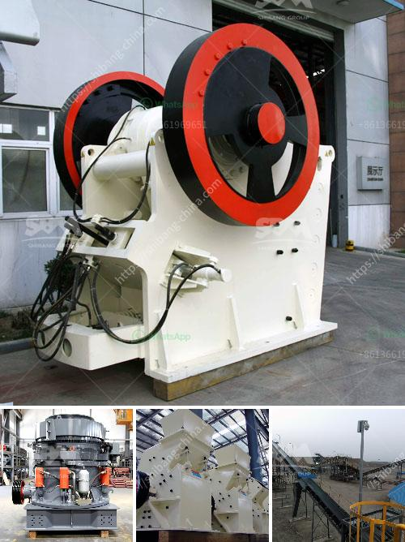

<h3>cost of cement manufacturing plant</h3>
The cost of a cement manufacturing plant can vary widely, depending on the size and efficiency of the plant, the materials used in the manufacturing process, and the location of the plant. While estimates can be made to determine the overall cost of a cement manufacturing plant, it is important to consider all factors and conduct a thorough analysis before investing in such a project.

Before delving into the cost of a cement manufacturing plant, it is crucial to understand the basics of the cement manufacturing process. Cement is produced by heating a mixture of limestone, clay, and other materials at a high temperature in a kiln. This process, known as calcination, releases carbon dioxide and transforms the raw materials into a substance called clinker. The clinker is then ground into a fine powder, known as cement, which is used in construction projects around the world.

The size of the cement manufacturing plant is one of the primary factors that influence its cost. A small-scale plant with a capacity of around 300-500 tons per day can be built with a relatively low cost, while larger-scale plants with a capacity of 1000 tons per day or more will require a more significant investment. The size of the plant will also impact the costs associated with land, building, and infrastructure.

Furthermore, the efficiency of the plant plays a crucial role in determining its cost. Modern cement manufacturing plants are designed to be highly efficient, using advanced technologies and equipment to reduce energy consumption and increase productivity. Implementing energy-saving measures, such as using alternative fuels or improving waste heat recovery, can help reduce the overall cost of the plant operation.

The quality and cost of raw materials are also factors that affect the cost of cement manufacturing. Limestone, clay, and other materials used in the process must be of high quality and readily available. The transportation cost of these raw materials from the quarry to the plant site should also be considered in the overall cost analysis.

The location of the cement manufacturing plant can impact both the cost and profitability of the project. It is essential to choose a location that is near raw material sources, as well as markets for the cement product. Transporting raw materials over long distances can significantly increase costs, while being close to markets can reduce transportation expenses and increase profitability.

Other costs associated with a cement manufacturing plant include labor, utilities, maintenance, and regulatory compliance. Finding skilled labor and providing proper training can contribute to the overall success of the plant. Additionally, costs such as electricity, water, and fuel consumption should be estimated and accounted for during the project planning.

In conclusion, determining the cost of a cement manufacturing plant requires careful consideration of various factors. The size and efficiency of the plant, the quality and cost of raw materials, the location, and other expenses all play a crucial role in determining the overall cost. Conducting a comprehensive analysis and understanding the complexities of the cement manufacturing process are essential steps in estimating the cost accurately. By taking these factors into account, investors can make informed decisions and ensure the success of their cement manufacturing project.
<h3>Contact us</h3><ul><li><strong>Whatsapp:&nbsp;<a href="https://wa.me/8613661969651">+8613661969651</a></strong></li><li><a href="https://swt.shibang-china.com/?git&amp;zhl&amp;cost of cement manufacturing plant"><strong>Online Service(chat now)</strong></a></li></ul><h3>Related</h3><ul><li><a href='gold plant for sale in africa.md'>gold plant for sale in africa</a></li><li><a href='calcium carbonate plant price.md'>calcium carbonate plant price</a></li><li><a href='manganese ore wash plant.md'>manganese ore wash plant</a></li><li><a href='vibrating screen in south africa.md'>vibrating screen in south africa</a></li><li><a href='gold wash plant for sale in brazil.md'>gold wash plant for sale in brazil</a></li></ul>