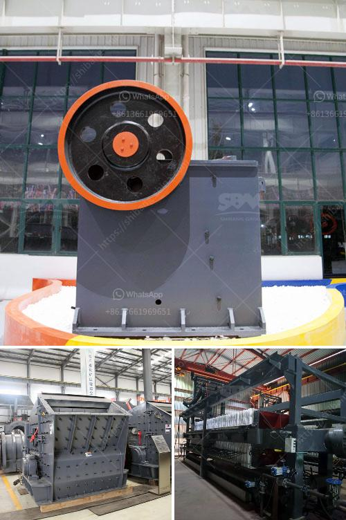

<h3>cost of crushed concrete</h3>
When it comes to construction projects, one of the main concerns that contractors and homeowners have is finding cost-effective materials that still meet their project requirements. This is where crushed concrete comes into play. Crushed concrete has gained popularity as a versatile and affordable option for various construction projects.

The cost of crushed concrete usually varies depending on the size of the concrete pieces and the type of crushing equipment used. Generally, larger pieces of concrete cost more due to the additional labor and equipment required to crush them into smaller sizes. On average, the cost of crushed concrete ranges from $5 to $15 per ton, including delivery fees.

One of the main reasons why crushed concrete is economical is that it is often produced from recycled concrete. Instead of sending concrete waste to landfills, it is crushed and repurposed for various applications, such as road base, fill material, or as an aggregate in concrete production. By utilizing recycled materials, construction costs are reduced, and the environmental impact is minimized.

Another reason for the cost-effectiveness of crushed concrete is its durability and longevity. Crushed concrete is often used as a strong and stable base material for driveways, parking lots, and foundations. It provides excellent drainage properties and doesn't crack or shift like traditional gravel. This means fewer repairs and maintenance in the long run, saving both time and money.

In addition to its affordability and durability, crushed concrete is also aesthetically pleasing. Its uniformity in size and color can create a clean and modern appearance when used in landscaping or decorative applications. It can be used as an alternative to traditional gravel in pathways, patios, or as a base for pavers.

When considering the cost of crushed concrete, it's important to keep in mind the long-term benefits it provides. Not only does it offer significant cost savings upfront, but its durability and versatility also lead to reduced maintenance and replacement costs over time. Whether it's for a small residential project or a large commercial undertaking, crushed concrete proves to be a reliable and cost-effective solution.
<h3>Contact us</h3><ul><li><strong>Whatsapp:&nbsp;<a href="https://wa.me/8613661969651">+8613661969651</a></strong></li><li><a href="https://swt.shibang-china.com/?git&amp;zhl&amp;cost of crushed concrete"><strong>Online Service(chat now)</strong></a></li></ul><h3>Related</h3><ul><li><a href='philippines crushing equipment for sale kenya.md'>philippines crushing equipment for sale kenya</a></li><li><a href='rock cone crushers.md'>rock cone crushers</a></li><li><a href='quartz crusher machinery.md'>quartz crusher machinery</a></li><li><a href='crusher manufacturers in russia.md'>crusher manufacturers in russia</a></li><li><a href='how to draw a stone crusher.md'>how to draw a stone crusher</a></li></ul>