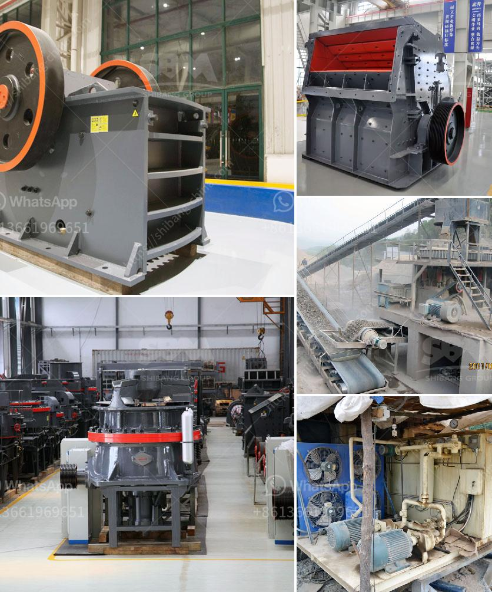

<h3>cost of grinder machine mining crusher</h3>
The cost of a grinder machine used in mining and crushing operations can vary greatly depending on several factors. These factors include the type of machine, its capacity, power requirements, and other specifications. In general, grinders are essential equipment used in various industries to break down large rocks, ores, and minerals into smaller, more manageable pieces.

One of the primary determinants of cost is the type of grinder machine chosen. There are several types of mining crusher machines available, including jaw crushers, cone crushers, impact crushers, and hammer crushers. Each of these machines is designed for different purposes, and their prices can vary accordingly. For example, a jaw crusher is typically used for primary crushing tasks and may be more expensive than other types due to its higher capacity and robust construction.

The capacity of the grinder machine is another crucial factor affecting its cost. Different models of mining crushers have different maximum capacities and output sizes. Machines with higher capacities are generally more expensive than those with lower capacities since they can process larger quantities of raw materials at a faster rate. Furthermore, grinders with adjustable output sizes may cost more due to the added flexibility and versatility they offer.

Moreover, power requirements can significantly impact the cost of a grinder machine. Some grinders operate on electricity, while others require diesel or gasoline as a power source. As a result, the availability and cost of the required power supply can influence the overall price of the machine. Additionally, machines with advanced features, such as automated controls or efficient energy consumption, may come at a higher cost initially but can save operational expenses in the long run.

Lastly, certain features and specifications can increase the cost of a mining grinder machine. These may include anti-wear components, advanced safety features, noise reduction systems, or dust control mechanisms. While these additional features can enhance the machine's performance and longevity, they also contribute to the final price.

In conclusion, the cost of a grinder machine used in mining and crushing operations can vary depending on factors such as the type of machine, its capacity, power requirements, and additional features. Investing in a high-quality and efficient grinder machine is crucial for maximizing productivity and minimizing downtime in mining operations.
<h3>Contact us</h3><ul><li><strong>Whatsapp:&nbsp;<a href="https://wa.me/8613661969651">+8613661969651</a></strong></li><li><a href="https://swt.shibang-china.com/?git&amp;zhl&amp;cost of grinder machine mining crusher"><strong>Online Service(chat now)</strong></a></li></ul><h3>Related</h3><ul><li><a href='vertical grinder for spindle.md'>vertical grinder for spindle</a></li><li><a href='ball mill equipment 150 tons hr.md'>ball mill equipment 150 tons hr</a></li><li><a href='gypsum portland cement retarder manufacturer usa.md'>gypsum portland cement retarder manufacturer usa</a></li><li><a href='brick making machine in zimbabwe.md'>brick making machine in zimbabwe</a></li><li><a href='jaw crusher 400 600.md'>jaw crusher 400 600</a></li></ul>