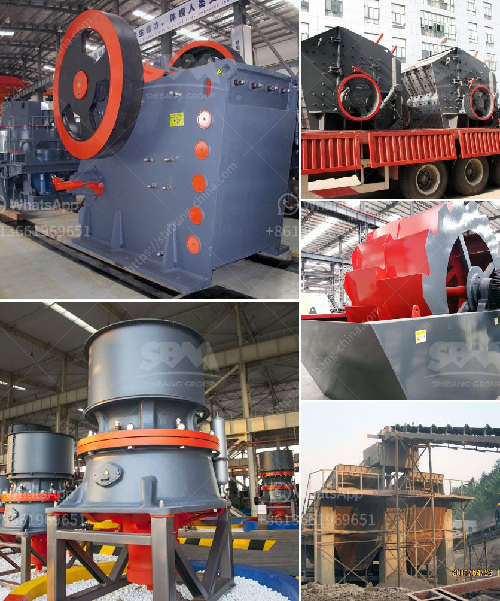

<h3>cost of mini pulvrizers crusher</h3>
Mini pulverizers crushers have become increasingly popular in various industries due to their small size and cost-effectiveness. These compact machines offer efficient crushing solutions for processing a wide range of materials, including coal, limestone, clay, and even plastic. If you are considering purchasing a mini pulverizer crusher, it is essential to understand the cost factors associated with these machines.

The upfront cost of a mini pulverizer crusher can vary depending on several factors. Firstly, the capacity of the machine plays a significant role in determining its price. Generally, mini pulverizer crushers with higher output capacities tend to be more expensive. For instance, a machine with a capacity of crushing 50 tons of material per hour will cost more than a unit capable of crushing 25 tons per hour.

Another important consideration is the manufacturer or brand of the mini pulverizer crusher. Well-established brands tend to have higher prices due to their reputation and quality assurance. However, opting for a renowned brand ensures you are investing in a reliable and durable machine, which may lead to long-term cost savings in terms of maintenance and repairs.

Moreover, the materials used in manufacturing a mini pulverizer crusher also impact its cost. Some crushers are made from high-grade stainless steel or alloy metals, making them more expensive than those made from regular carbon steel. While stainless steel crushers offer superior durability and resistance to corrosion, they may not be necessary for applications where less rugged materials can suffice.

Apart from the initial cost, it is crucial to consider the operational expenses associated with a mini pulverizer crusher. One primary ongoing cost is power consumption. The energy consumption of the machine will depend on its motor power, and operating it continuously for extended periods can significantly impact your electricity bill. Therefore, it is vital to choose a crusher with an appropriate motor power that suits your operational needs while minimizing power consumption.

Maintenance and replacement costs should also be taken into account. Mini pulverizer crushers, like any other machinery, require regular maintenance to ensure optimum performance and longevity. Routine tasks such as lubricating moving parts, replacing worn-out blades or hammers, and cleaning the machine are essential for preventing breakdowns and reducing repair costs. Moreover, spare parts availability and their cost should be considered, as replacing specific components can be expensive depending on the brand and availability.

When evaluating the cost of a mini pulverizer crusher, it is crucial to assess its long-term benefits. These machines can significantly improve operational efficiency, decrease labor requirements, and reduce material wastage. By investing in a mini pulverizer crusher, businesses can experience improved productivity and cost savings by utilizing crushed material as raw material for other processes or selling it to generate additional income.

In conclusion, the cost of mini pulverizer crushers encompasses various elements such as upfront price, manufacturer reputation, material quality, operational expenses, and maintenance costs. It is essential to conduct thorough research and evaluate your specific requirements before making a purchasing decision. Opting for a reliable brand and selecting a machine that aligns with your production needs can ensure that your investment in a mini pulverizer crusher provides long-term value while staying within your budget.
<h3>Contact us</h3><ul><li><strong>Whatsapp:&nbsp;<a href="https://wa.me/8613661969651">+8613661969651</a></strong></li><li><a href="https://swt.shibang-china.com/?git&amp;zhl&amp;cost of mini pulvrizers crusher"><strong>Online Service(chat now)</strong></a></li></ul><h3>Related</h3><ul><li><a href='feldspar refining and processing equipment.md'>feldspar refining and processing equipment</a></li><li><a href='south africa used chrome ore mining crushing equipment.md'>south africa used chrome ore mining crushing equipment</a></li><li><a href='gold mining crushing and processing plant price.md'>gold mining crushing and processing plant price</a></li><li><a href='limestone used for making glass.md'>limestone used for making glass</a></li><li><a href='ball mill capacity for clay.md'>ball mill capacity for clay</a></li></ul>