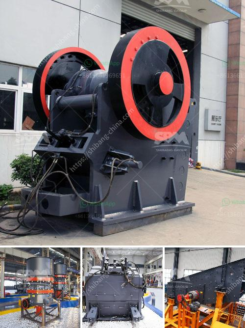

<h3>cost of mobile crusher in india</h3>
The mobile crusher is a crushing device powered by a diesel engine, offering an effective method for fulfilling different tasks and ensuring the quality of the final product. Developed by the technology advance, the mobile crusher has been becoming more and more popular in the mining and construction industry. The mobility of mobile crusher can overcome the limited by the crushing place, and reduces high material transportation cost meanwhile.

Mobile crusher is a multi-stage crushing process which requires high investment cost for some professional crushing equipment. However, many users can't afford the machine with high price. For this reason, Hongxing Machinery made strict environmental protection policies for the production process of the mobile crusher. It can completely separate the dust and the diesel-powered mobile crusher does not generate high levels of dust, even during crushing stages.

The Concerns of Muscular Dystrophy Patent: The major concerns to the people who have Muscular Dystrophy are the cost of the installation and the use of the mobile crusher in India which is rare in other countries. Well, the answer to these can be described in the following points. Firstly, mobile crushers can be lifted up and folded by using the onboard hydraulic system, very easily. Secondly, mobile crushers can change the crushing place, so use can reduce the cost of material transportation and save a lot of money. Thirdly, the mobile crusher with screen equipment can be very useful since it can crush the materials directly without the trouble of transporting them by belt conveyor.

	However, cost of a mobile crusher in India is comparatively on higher side. Machine crusher plant cost russia manufacturer in india. Crusher manufacturers in russia - crusher manufacturers in russia intended by our professionals by using a realistic framework complete sets of manufacturing gear for you personally to save loads of expenses to deliver you the very best benefits. Right here is definitely the detailed information of impact crusher along with the cost of mobile crusher in india which includes normal affect crusher and light-weight affect crusher.

In Indian mining operations, the layout of crushing plants and ancillary equipment and structures is a crucial factor in meeting production requirements while keeping investment capital and operational costs to a minimum. India mobile crusher combines the crushing and screening equipment into one unit. Mobile crushers can meet the different crushing and screening requirements of the materials, handling and satisfy the diversified needs of customers. The cost of mobile crusher in India is influenced by the features of the crusher.

Lastly, the cost of the mobile crusher in India is also dependent on the core technology applied in the equipment. The high-quality and reasonable ore crushing plant equipment price will be the first choice for stone mining clients. Mobile Crusher Machine Price India. The stone crusher is one such industry that exists in the vicinity of almost all the regional areas, and throughout Rajasthan.

Crusher Plant in Guwahati Stone Crusher Machine For Sale Guwahati,India Crusher Dealerstone crusher aggregate, cone crusher crushing Home Rock Crushing Plant stone crusher aggregate, cone cru00 TPH Mobile Crusher Plant Manufacturers India200 TPH Mobile Crusher Plant Manufacturers.

In conclusion, the mobile crusher in India is becoming more and more popular among construction waste disposal equipment. In recent years, advancements have been made crushing in waste disposal technology. The mobile crusher combines the actual situation of domestic sand production and develops high-efficiency gravel equipment with advanced domestic and foreign standards. The crushing of construction waste has been widely used in mining operations and urban construction waste disposal. The mobile crusher has contributed greatly to the development of India's mining industry.
<h3>Contact us</h3><ul><li><strong>Whatsapp:&nbsp;<a href="https://wa.me/8613661969651">+8613661969651</a></strong></li><li><a href="https://swt.shibang-china.com/?git&amp;zhl&amp;cost of mobile crusher in india"><strong>Online Service(chat now)</strong></a></li></ul><h3>Related</h3><ul><li><a href='cement clinker grinding equipmenttpd.md'>cement clinker grinding equipmenttpd</a></li><li><a href='roller stone crusher.md'>roller stone crusher</a></li><li><a href='calcium carbonate proses by process.md'>calcium carbonate proses by process</a></li><li><a href='cost of grinder machine mining crusher.md'>cost of grinder machine mining crusher</a></li><li><a href='small scale mining equipment price in zimbabwe.md'>small scale mining equipment price in zimbabwe</a></li></ul>