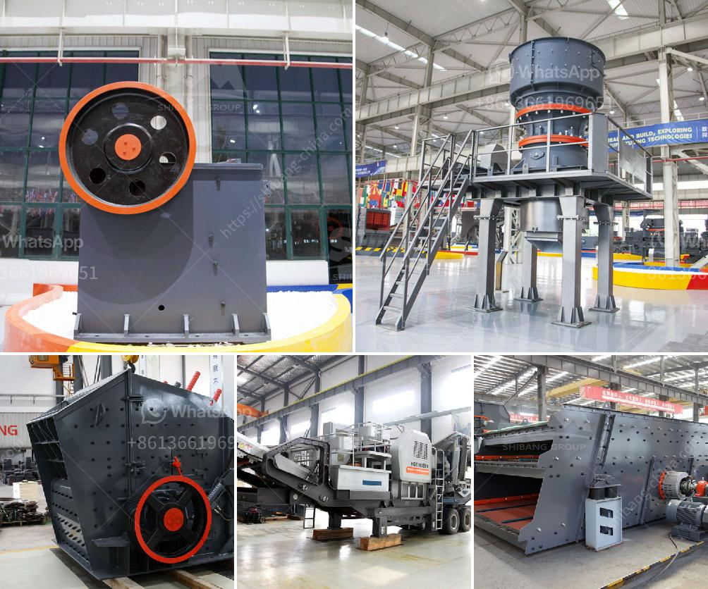

<h3>cost of setting up a kaolin production plant</h3>
Kaolin, also known as china clay, is a white, soft, clay mineral that is used in a variety of industries including paper, ceramics, rubber, paints, and many others. It is obtained from the weathering of feldspar rocks and is highly valued for its purity and brightness.

Setting up a kaolin production plant requires careful planning and consideration of various factors, including the cost of equipment, raw materials, labor, and ongoing operational expenses. In this article, we will explore the estimated cost of setting up a kaolin production plant.

One of the primary factors to consider is the cost of equipment. This includes machinery such as crushers, mills, dryers, and classifiers. The cost of these equipment can vary depending on the size and capacity required for the plant. A small-scale kaolin production plant may require an initial investment of approximately $1 million, while a larger plant with higher capacity could cost upwards of $10 million.

Another significant cost when setting up a kaolin production plant is the cost of raw materials. Kaolin is typically mined from deposits or extracted from quarries, and the cost of acquiring these raw materials can vary depending on their location and accessibility. Transportation costs also need to be factored in when calculating the overall cost of raw materials.

Labor costs are an essential consideration as well. The number of skilled workers required to operate the plant and maintain its machinery will depend on the plant's scale and production capacity. Skilled workers, such as engineers, technicians, and production supervisors, will play a crucial role in ensuring the smooth operation of the plant. Labor costs can significantly impact the overall cost of setting up a kaolin production plant.

Ongoing operational expenses also need to be accounted for when estimating the overall cost of setting up a kaolin production plant. These expenses include energy costs for operating the machinery, maintenance and repair costs, and administrative expenses. It is crucial to budget for these ongoing expenses to ensure the plant's profitability in the long term.

Additionally, compliance with environmental regulations may also increase costs. Establishing proper waste management systems, water treatment facilities, and implementing environmentally friendly production processes may require additional investments. These costs are essential for the sustainability and reputation of the kaolin production plant.

In conclusion, setting up a kaolin production plant involves significant investment in equipment, raw materials, labor, and ongoing operational expenses. The cost of setting up a kaolin production plant can vary widely depending on the plant's size, capacity, location, and compliance with environmental regulations. It is essential to conduct a thorough feasibility study and financial analysis before embarking on such a venture to ensure its long-term viability and profitability.
<h3>Contact us</h3><ul><li><strong>Whatsapp:&nbsp;<a href="https://wa.me/8613661969651">+8613661969651</a></strong></li><li><a href="https://swt.shibang-china.com/?git&amp;zhl&amp;cost of setting up a kaolin production plant"><strong>Online Service(chat now)</strong></a></li></ul><h3>Related</h3><ul><li><a href='grinding machine manufacturers from europe.md'>grinding machine manufacturers from europe</a></li><li><a href='famous manganese cone crusher parts made in luoyang china.md'>famous manganese cone crusher parts made in luoyang china</a></li><li><a href='crushers for aggregate production.md'>crushers for aggregate production</a></li><li><a href='costs mobile crushing and screening plant.md'>costs mobile crushing and screening plant</a></li><li><a href='crusher machine for sale philippines.md'>crusher machine for sale philippines</a></li></ul>