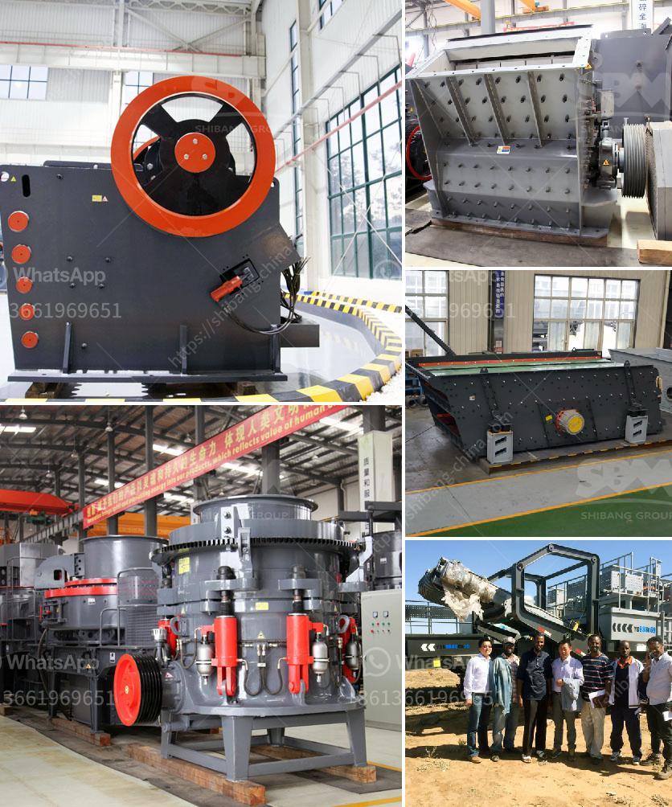

<h3>cost of setting up cement plant in south africa</h3>
The cost of setting up a cement plant in South Africa can be daunting and challenging, especially if you don't have sufficient knowledge and information about the environment in which you wish to operate. However, with proper planning, careful research, and a little bit of patience, it is possible to establish a successful cement plant in South Africa.

Firstly, it is important to note that the construction industry in South Africa is fast-growing and highly competitive. The demand for cement is high due to ongoing infrastructure development projects, residential and commercial construction, and the need for repair and maintenance of existing infrastructure. Therefore, investing in a cement plant can be a profitable venture if executed efficiently.

One of the first considerations when setting up a cement plant is obtaining the necessary licenses and permits from the relevant authorities. This process may require hiring legal and administrative professionals who are well-versed in South Africa's regulations and procedures. These professionals can guide you through the process and ensure compliance with all legal requirements.

Another crucial aspect is acquiring suitable land for the cement plant. The cost of land varies depending on the location and size of the plant. It is advisable to conduct thorough research and feasibility studies to identify the most suitable location that provides accessibility, proximity to raw materials, and proximity to target markets.

Speaking of raw materials, the cost of setting up a cement plant is significantly influenced by the availability and accessibility of limestone, the primary raw material for cement production. South Africa is blessed with an abundance of limestone deposits, which reduces the cost of transporting raw materials from distant locations. This factor can positively impact the overall setup cost.

Furthermore, sourcing reliable suppliers of other essential raw materials, such as gypsum, clay, and silica, is critical. South Africa has several reputable suppliers that provide these materials, but it is necessary to obtain competitive pricing to minimize costs in the long run.

The process of cement production involves high-energy consumption and requires heavy machinery. Therefore, another considerable expense is procuring and importing the required equipment. The cost of machinery varies depending on the capacity and quality required for your plant. It is advisable to consult with knowledgeable professionals or collaborate with experienced cement manufacturers to ensure that you acquire the most suitable equipment at competitive prices.

Labor costs are also a significant consideration when setting up a cement plant. South Africa offers a relatively skilled and abundant workforce, but labor laws and wage regulations must be considered. Developing an efficient labor management strategy that promotes productivity and reduces labor costs is essential for the long-term success of the plant.

Additionally, it is crucial to consider the cost of electricity, as it is a significant operational expense for cement plants. South Africa has been facing challenges with electricity supply and increasing tariffs. Exploring renewable energy options, such as solar and wind power, can help offset electricity costs and contribute to a more sustainable operation.

In conclusion, setting up a cement plant in South Africa requires comprehensive planning, market research, and careful consideration of various factors. The costs involved in establishing the plant, including licenses, land acquisition, raw material sourcing, machinery procurement, labor, and electricity, are significant. However, with strategic planning and efficient execution, the potential for profitability and success in South Africa's cement industry is promising.
<h3>Contact us</h3><ul><li><strong>Whatsapp:&nbsp;<a href="https://wa.me/8613661969651">+8613661969651</a></strong></li><li><a href="https://swt.shibang-china.com/?git&amp;zhl&amp;cost of setting up cement plant in south africa"><strong>Online Service(chat now)</strong></a></li></ul><h3>Related</h3><ul><li><a href='grinding mill of cerial in ethiopia.md'>grinding mill of cerial in ethiopia</a></li><li><a href='rock crushers ball mill.md'>rock crushers ball mill</a></li><li><a href='stone crusher prices german.md'>stone crusher prices german</a></li><li><a href='brick factory for sale in uk.md'>brick factory for sale in uk</a></li><li><a href='ball mills for large mining.md'>ball mills for large mining</a></li></ul>