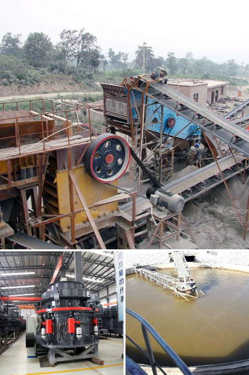

<h3>cost of starting a small gold mine zimbabwe</h3>
Zimbabwe is rich in minerals like gold and is one of Africa's leading producers of this precious metal. Starting a small gold mine in Zimbabwe is a promising venture that is, unfortunately, fraught with challenges. The costs of starting a small gold mine are incredibly high, but if the mine is a successful one, investors can reap rewards that will outweigh these challenges. In this article, we will explore the various costs involved in starting a small gold mine in Zimbabwe.

Land Acquisition: The first step in setting up a gold mine is acquiring the appropriate land. In Zimbabwe, obtaining a mining license from the Ministry of Mines and Mining Development is a crucial requirement. However, the process for acquiring land can be tedious, time-consuming, and expensive. Aspiring mine owners must secure a mining lease or claim, which can cost up to $10,000 or more, depending on the location and size of the land.

Exploration and Geological Surveys: Before investing significant money in setting up a mine, it is crucial to conduct exploration activities and geological surveys. Hiring experienced geologists and other experts to conduct these surveys can be quite expensive. The costs of exploration can range anywhere from $50,000 to $300,000, depending on the complexity and scale of the project.

Equipment and Machinery: Gold mining requires heavy machinery and equipment to extract the precious metal efficiently. This includes excavators, drills, crushers, and other specialized machinery. The cost of acquiring these machinery and equipment can easily reach several million dollars, especially if you opt for new and state-of-the-art technology. However, second-hand equipment can be cheaper, but it may require additional maintenance and repairs.

Labor and Operating Costs: Running a gold mine efficiently requires a skilled and competent workforce. From miners to administrative staff, labor costs can be significant. Furthermore, operational costs such as electricity, water supply, fuel, and maintenance must be factored in. These expenses can amount to hundreds of thousands of dollars per year, depending on the size of the mining operation.

Environmental Compliance: Today, there is a greater emphasis on eco-friendly mining practices, and Zimbabwe has strict regulations in place to protect the environment. Compliance with these regulations can add significant costs to starting a small gold mine. Environmental impact assessments, waste management systems, and proper land rehabilitation must be budgeted for accordingly.

Security and Safety Measures: Gold mining operations are susceptible to theft, illegal mining, and other security threats. Therefore, implementing security measures is critical to safeguarding the investment. These measures may include the installation of surveillance cameras, hiring security personnel, and implementing security protocols. All these come at a considerable cost and should be factored into the overall budget.

In conclusion, starting a small gold mine in Zimbabwe is a high-risk venture due to the significant costs involved. From land acquisition to exploration activities, equipment purchase, labor, compliance, security, and operating costs, all require careful planning and considerable financial resources. However, if undertaken successfully, a small gold mine in Zimbabwe has the potential to generate substantial profits. As with any investment, thorough research, proper budgeting, and a sound business plan are key to increasing the chances of success.
<h3>Contact us</h3><ul><li><strong>Whatsapp:&nbsp;<a href="https://wa.me/8613661969651">+8613661969651</a></strong></li><li><a href="https://swt.shibang-china.com/?git&amp;zhl&amp;cost of starting a small gold mine zimbabwe"><strong>Online Service(chat now)</strong></a></li></ul><h3>Related</h3><ul><li><a href='calcium carbonate crushers.md'>calcium carbonate crushers</a></li><li><a href='concrete grinding machine manufacturers.md'>concrete grinding machine manufacturers</a></li><li><a href='mobile crusher 100tph.md'>mobile crusher 100tph</a></li><li><a href='limestone grinding mill.md'>limestone grinding mill</a></li><li><a href='buy ultra fine grinder mill.md'>buy ultra fine grinder mill</a></li></ul>