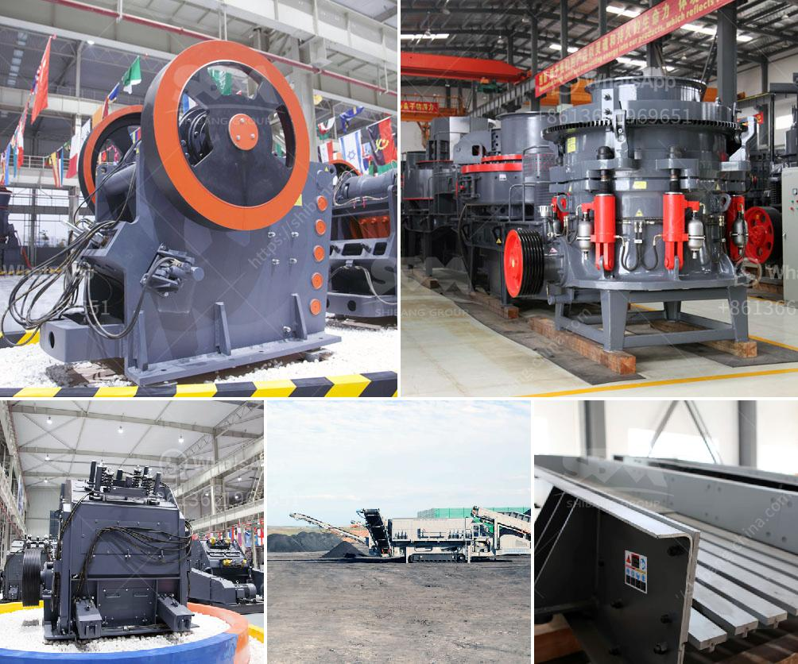

<h3>cost of the project for 100 tph stone crushing unit</h3>
The cost of the project for a 100 tph stone crushing unit can vary based on different factors such as geographical location, size and type of raw material availability, machinery cost, labor cost, power consumption, specific market demands, etc. However, in general, a 100 tph stone crushing unit can be easily established and operated within an estimated budget of around $50,000 to $100,000.

To set up a 100 tph stone crushing unit, several components need to be prioritized. Firstly, land availability is crucial as it determines the location of the crushing unit. Adequate land with necessary infrastructure such as roads, drainage system, electricity, and water supply is required. The cost of land can vary greatly depending on the location and demand.

Another major aspect is obtaining the necessary machinery. A typical 100 tph stone crushing unit would require a feed bin, a jaw crusher, a cone crusher, a vibrating screen, belt conveyors, and several other auxiliary equipment. The machinery cost can vary widely based on the features, capacity, and quality of the equipment. As a rough estimate, the cost for all the necessary machinery can range from $40,000 to $70,000.

In addition to land and machinery, labor costs also need to be taken into account. The number of workers required would depend on the scale of the project and the daily production capacity. The labor cost can vary depending on regional factors, regulations, and the skill level of the workforce.

Furthermore, it is important to consider other expenses such as power consumption, maintenance, and miscellaneous expenses. These costs may vary depending on the efficiency of the machinery, local energy rates, and specific market demands.

In conclusion, setting up a 100 tph stone crushing unit can involve various costs that need to be considered beforehand. However, an estimated budget of $50,000 to $100,000 can generally cover the necessary expenses for land, machinery, labor, and other operational costs. Conducting a thorough market research and cost analysis is recommended to have a more accurate estimate and ensure the success of the project.
<h3>Contact us</h3><ul><li><strong>Whatsapp:&nbsp;<a href="https://wa.me/8613661969651">+8613661969651</a></strong></li><li><a href="https://swt.shibang-china.com/?git&amp;zhl&amp;cost of the project for 100 tph stone crushing unit"><strong>Online Service(chat now)</strong></a></li></ul><h3>Related</h3><ul><li><a href='mobile crusher 100tph.md'>mobile crusher 100tph</a></li><li><a href='slag crusher machine india.md'>slag crusher machine india</a></li><li><a href='buy stone crusher machine in saudi arabia.md'>buy stone crusher machine in saudi arabia</a></li><li><a href='black stone crushing nigeria.md'>black stone crushing nigeria</a></li><li><a href='small jaw crusher for sale.md'>small jaw crusher for sale</a></li></ul>