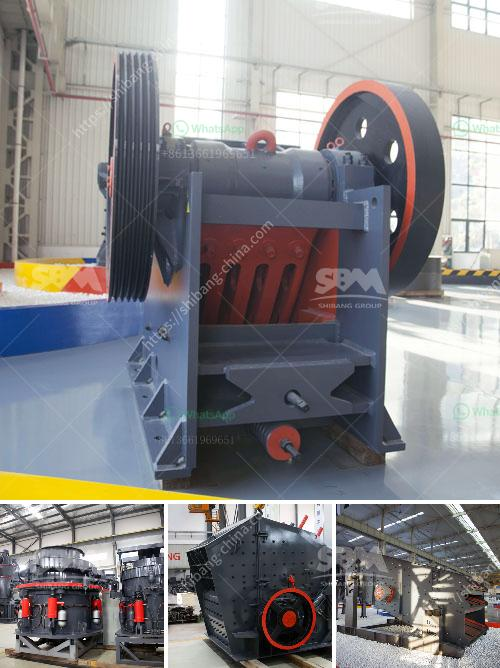

<h3>cost of tonne per day cement plant</h3>
The cost of a tonne per day cement plant can vary significantly depending on factors such as location, size, and operational scope. Cement plants are industrial facilities that produce cement from raw materials such as limestone, clay, and gypsum. They play a crucial role in the construction industry by supplying the primary material for buildings, bridges, roads, and other infrastructure projects.

The cost of setting up a tonne per day cement plant involves multiple components. First and foremost, there is the cost of acquiring suitable land for the plant. The location of the plant can also impact the cost, as transportation expenses for raw materials and finished products need to be considered. Furthermore, the cost of obtaining permits and licenses, as well as complying with environmental regulations, adds to the overall expenses.

The size of the cement plant also plays a significant role in determining the cost. Larger plants tend to have higher initial investments due to the higher production capacity and the need for more machinery and equipment. On the other hand, smaller plants may have lower upfront costs but may face challenges in achieving economies of scale.

Other cost considerations include the technology and equipment used in the cement manufacturing process. Modern, more efficient technologies may result in higher initial investments but can lead to cost savings in the long run through reduced energy consumption and improved productivity.

Another aspect that impacts the cost is the scope of operations. Some cement plants focus solely on the production of cement, while others have integrated operations that involve additional processes such as the manufacturing of concrete or precast products. The latter type of plant typically requires more complex machinery and infrastructure, leading to higher costs compared to standalone cement production plants.

In conclusion, the cost of a tonne per day cement plant can range widely depending on various factors. Investors and developers interested in establishing a cement plant must carefully analyze these factors and consider the location, size, operational scope, and technology to determine the overall investment required. A comprehensive feasibility study along with detailed cost analysis is essential to make informed decisions and ensure the plant's long-term profitability.
<h3>Contact us</h3><ul><li><strong>Whatsapp:&nbsp;<a href="https://wa.me/8613661969651">+8613661969651</a></strong></li><li><a href="https://swt.shibang-china.com/?git&amp;zhl&amp;cost of tonne per day cement plant"><strong>Online Service(chat now)</strong></a></li></ul><h3>Related</h3><ul><li><a href='kokstad grinding mill for sale.md'>kokstad grinding mill for sale</a></li><li><a href='stone quarries in uganda.md'>stone quarries in uganda</a></li><li><a href='impact crusher in lima peru.md'>impact crusher in lima peru</a></li><li><a href='quarry crusher philippines.md'>quarry crusher philippines</a></li><li><a href='quarry crushing plants in south africa.md'>quarry crushing plants in south africa</a></li></ul>