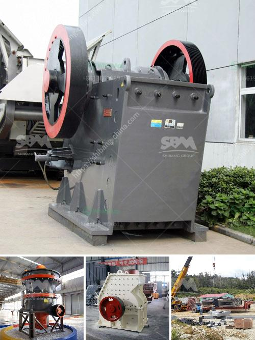

<h3>cost to produce crushed stone per ton at a quarry</h3>
The cost of producing crushed stone per ton at a quarry is consistently on the rise. This upward trend has persisted for several decades and shows no sign of abating. While there are several factors that contribute to this increase, the primary drivers are the rising costs of labor, fuel, and equipment maintenance.

Labor costs have been inching upwards over the years due to inflation and increasing demand for workers in the construction industry. Quarry operations require a significant number of employees, ranging from stone crushers and haul truck drivers to maintenance technicians and administrative staff. Each role plays a crucial part in the production of crushed stone, and the wages associated with these jobs make up a substantial portion of the production cost per ton.

Fuel costs also pose a significant challenge to quarry operators. The heavy machinery used in the quarry industry, such as bulldozers, loaders, and trucks, rely on diesel fuel to operate. The ever-increasing price of fuel greatly impacts the cost per ton of crushed stone. Quarry owners often have to adjust their budgets to accommodate the fluctuating gas prices, which can cause a ripple effect throughout the industry.

In addition to fuel costs, maintenance and repair expenses further contribute to the rising cost of production. Quarry machinery undergoes substantial wear and tear due to the constant movement of rocks and stones. Regular maintenance and repairs are necessary to keep the equipment in optimal condition, mitigating breakdowns and ensuring consistent production. Consequently, quarry operators must allocate a significant portion of their budget toward machinery upkeep, which in turn increases the overall cost per ton of crushed stone.

Another factor that affects the cost of production at quarries is the cost of obtaining the necessary permits and licenses. Quarry operations, especially in densely populated areas, require compliance with various regulations to mitigate environmental and safety concerns. Acquiring permits, conducting environmental impact assessments, and adhering to zoning requirements can prove to be time-consuming and expensive. These costs are ultimately passed on to consumers through the price per ton of crushed stone.

Furthermore, transportation costs play a role in the overall cost of production. Quarries are typically located in rural areas, far from urban centers where demand for crushed stone is highest. Shipping large quantities of crushed stone to construction sites requires an extensive transportation network, including trucks and rail systems. Transportation costs add to the cost per ton of crushed stone, and they can vary depending on distance, fuel prices, and infrastructure availability.

In conclusion, the cost of producing crushed stone per ton at a quarry has been steadily increasing over the years. Rising labor costs, expensive fuel prices, machinery maintenance expenses, permit and license fees, and transportation costs all contribute to the overall upward trend. It is essential for quarry operators to closely monitor these factors and implement efficient management strategies to ensure that crushed stone remains affordable for the construction industry and consumers alike.
<h3>Contact us</h3><ul><li><strong>Whatsapp:&nbsp;<a href="https://wa.me/8613661969651">+8613661969651</a></strong></li><li><a href="https://swt.shibang-china.com/?git&amp;zhl&amp;cost to produce crushed stone per ton at a quarry"><strong>Online Service(chat now)</strong></a></li></ul><h3>Related</h3><ul><li><a href='super fine roller mill.md'>super fine roller mill</a></li><li><a href='conveyor belts manufacturers south africa.md'>conveyor belts manufacturers south africa</a></li><li><a href='three roller raymond mill.md'>three roller raymond mill</a></li><li><a href='services nigeria conveyor machine.md'>services nigeria conveyor machine</a></li><li><a href='precipitated calcium carbonate production plant design.md'>precipitated calcium carbonate production plant design</a></li></ul>