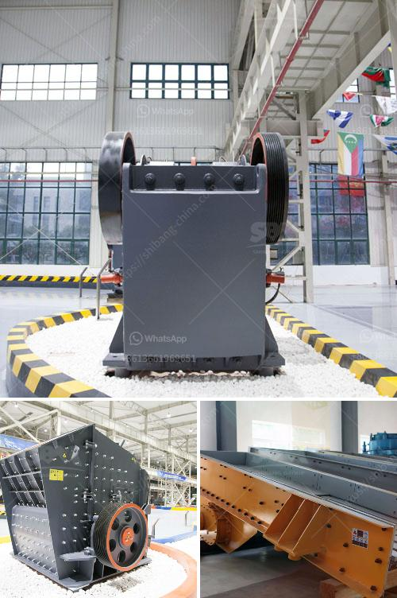

<h3>costo de la planta de procesamiento de coltan</h3>
El coltán es un mineral que ha ganado reconocimiento debido a su importancia en la fabricación de dispositivos electrónicos como teléfonos móviles y computadoras. Su demanda ha aumentado en los últimos años, lo que ha llevado a un incremento en el costo de procesamiento de la planta de coltán.

El coltán se extrae principalmente en la República Democrática del Congo, un país rico en recursos minerales pero afectado por conflictos armados y problemas sociales. Esto ha llevado a una situación complicada en la industria del coltán, con un suministro limitado y altos precios.

El costo de la planta de procesamiento de coltán varía dependiendo de diferentes factores como la ubicación, el tamaño de la planta y la capacidad de producción. Además, se deben considerar los costos asociados con la extracción, transporte y mantenimiento de la planta.

En general, el costo de la planta de procesamiento de coltán puede oscilar entre varios millones de dólares hasta decenas de millones de dólares. Esto se debe a que la planta requiere equipos especializados para extraer y refinar el coltán, además de personal calificado y tecnología avanzada.

El alto costo de la planta de procesamiento de coltán se refleja en el precio final del mineral. Esto se traduce en un mayor costo para los fabricantes de dispositivos electrónicos, que pueden verse obligados a aumentar los precios de sus productos para compensar.

A pesar de los desafíos asociados con el costo de la planta de procesamiento de coltán, es importante destacar que este mineral juega un papel crucial en la industria electrónica. Los avances tecnológicos y la creciente demanda de dispositivos electrónicos continúan impulsando la necesidad de una mayor producción y procesamiento de coltán.

En conclusión, el costo de la planta de procesamiento de coltán es alto debido a la escasez de suministro, la ubicación geográfica y la necesidad de tecnología y personal especializado. Aunque esto puede resultar en un aumento del precio para los consumidores, es importante reconocer la importancia del coltán en la fabricación de dispositivos electrónicos y seguir buscando soluciones para mejorar su producción y abastecimiento.
<h3>Contact us</h3><ul><li><strong>Whatsapp:&nbsp;<a href="https://wa.me/8613661969651">+8613661969651</a></strong></li><li><a href="https://swt.shibang-china.com/?git&amp;zhl&amp;costo de la planta de procesamiento de coltan"><strong>Online Service(chat now)</strong></a></li></ul><h3>Related</h3><ul><li><a href='different between the mill and hammer crusher.md'>different between the mill and hammer crusher</a></li><li><a href='grinding roller mill.md'>grinding roller mill</a></li><li><a href='dolomite production process.md'>dolomite production process</a></li><li><a href='stone crusher in the philippines for sale.md'>stone crusher in the philippines for sale</a></li><li><a href='concrete crusher plant uae.md'>concrete crusher plant uae</a></li></ul>