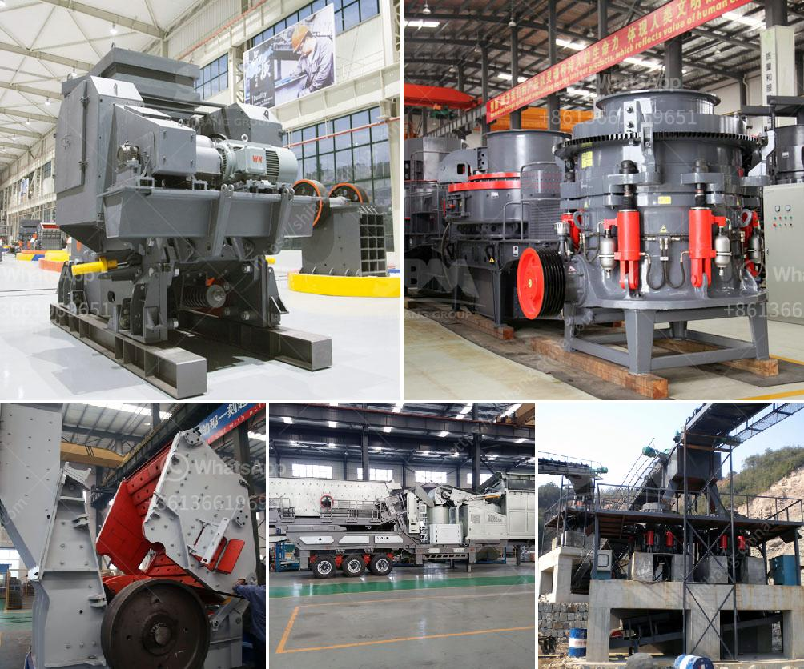

<h3>costs mobile crushing and screening plant</h3>
Mobile crushing and screening plants are compact systems that used to crush raw materials which are extracting from quarries and to classify them into desired sizes. If desired, we may integrate washing systems on our mobile units as well.

Recent years in consequence of the mobilization of the World, mobile crushers has been choosen instead of stationary plants with its easy installation and rapid displacement advantages. The new generation mobile crushers vary according to the type of the stone to be crushed and desired production capacity. Mobile crushers can be installed in desired places and cost rate is lower instead of fixed plants and these advantages preferred reason to choose mobile crushers nowadays.

Highly engineered mobile systems are assembled on a single mobile chassis with all their components, and provides easy maintanance and repair. Portable crusher plants having much more advantages to prefered instead of stationary plants. Advantages of Mobile Crusher Plant • With it's mobile structure, it has the advantage of the fastest production line. • Mobile units have a complete hydraulic unit. • With it's Hydraulic unit is a very useful feature for installing, dismantling and maintaining the equipment in very short time. • With it's feedback Conveyor it provides Closed Circuit crushing till desired size. • It can be used by single operator with it's fully automation system and feeding can be done by a truck, loader or excavator, which is both simple and efficient.

Furthermore, the plant is also equipped with an optional magnetic separator that clears metal bars and other debris from the material stream, increasing the quality of the final product. This can be particularly beneficial for applications in the mining and construction industries where the material needs to be as pure as possible.

Another advantage of mobile crushing and screening plants is the reduced costs associated with the whole process. Thanks to their compact size and ability to be moved easily, mobile crushing and screening plants can be relocated whenever necessary without too much expense. Mobile plants are completely self-contained, meaning that there is no need for additional equipment or infrastructure to make them operational. This results in substantial cost savings for companies.

Additionally, mobile crushing and screening plants require less maintenance compared to traditional crushing and screening plants. This is mainly due to the higher mobility of these plants, allowing for easier access for maintenance personnel. Furthermore, many mobile plants are equipped with a remote monitoring system, which enables operators to easily identify potential issues and address them before they become major problems.

In conclusion, mobile crushing and screening plants present a cost-effective and efficient alternative to stationary crushing and screening plants. They provide flexibility and convenience, allowing companies to easily relocate them when necessary and saving them money in the process. Additionally, the reduced maintenance and operational costs associated with mobile plants make them an attractive option for businesses in various industries. With the advancements in technology, mobile crushing and screening plants are becoming increasingly popular in the construction and mining industries.
<h3>Contact us</h3><ul><li><strong>Whatsapp:&nbsp;<a href="https://wa.me/8613661969651">+8613661969651</a></strong></li><li><a href="https://swt.shibang-china.com/?git&amp;zhl&amp;costs mobile crushing and screening plant"><strong>Online Service(chat now)</strong></a></li></ul><h3>Related</h3><ul><li><a href='vibrating screen designs.md'>vibrating screen designs</a></li><li><a href='coal vibration equipment size.md'>coal vibration equipment size</a></li><li><a href='business plan for marble and granite factory pdf.md'>business plan for marble and granite factory pdf</a></li><li><a href='komatsu mobile impact crusher.md'>komatsu mobile impact crusher</a></li><li><a href='small scale gold mining using stamp mill.md'>small scale gold mining using stamp mill</a></li></ul>