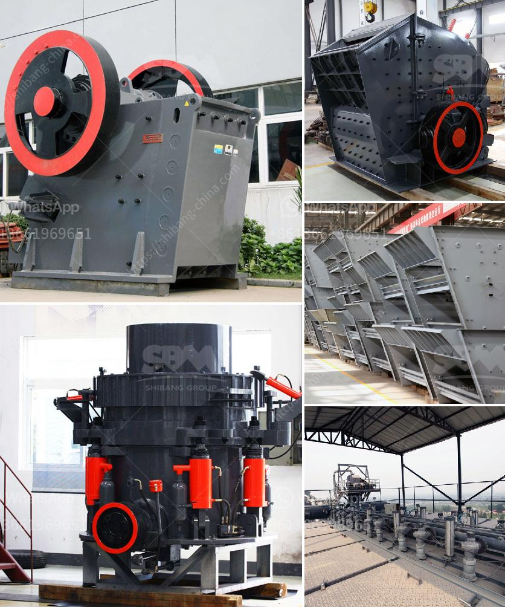

<h3>crawler type mobile crusher</h3>
Crawler type mobile crusher is a mobile crushing and screening equipment developed by our company with advanced technology and professional production experience at home and abroad. It adopts self-driving mode, advanced technology and complete functions. It can reach any position of the working site under any terrain conditions, enabling the crawler mobile crusher to move flexibly in different terrains, reducing transportation costs and improving efficiency.

The crawler type mobile crusher is suitable for a variety of mining, quarry, mixing and batching plant, road and building construction, highway, railway and subway, and water conservancy projects. It can process various materials such as construction waste, granite, basalt, iron ore, limestone, quartz stone, etc. It is widely used in primary crushing, secondary crushing, tertiary crushing, and fine crushing.

This mobile crusher is characterized by high flexibility and reliable performance. It adopts jaw crusher as the primary crushing equipment, which has the characteristics of large crushing ratio, uniform product size, simple structure, reliable operation, easy maintenance, and economic operating costs. In addition, the crawler type mobile crusher has a screening device, which can control the granularity of the finished product, and the conveyor device, which can achieve a closed circuit operation.

The crawler type mobile crusher has a high degree of automation and can be remotely operated. Compared with the traditional fixed crusher, it can save more time and labor costs. With the integration of the entire crushing and screening process, the crawler type mobile crusher can be used for on-site crushing of ore, coal, and construction waste. It is widely used for mining, smelting, building materials, highways, railways, water conservancy and chemical industries.

In conclusion, the crawler type mobile crusher is a versatile and efficient crushing equipment that can be used for a variety of materials and applications. It is flexible, reliable, and easy to operate, making it a preferred choice for many industries. Whether it is used for primary crushing, secondary crushing, or fine crushing, this mobile crusher ensures high productivity and cost-effective operations.
<h3>Contact us</h3><ul><li><strong>Whatsapp:&nbsp;<a href="https://wa.me/8613661969651">+8613661969651</a></strong></li><li><a href="https://swt.shibang-china.com/?git&amp;zhl&amp;crawler type mobile crusher"><strong>Online Service(chat now)</strong></a></li></ul><h3>Related</h3><ul><li><a href='flsmidth cement plant in egypt.md'>flsmidth cement plant in egypt</a></li><li><a href='prices of vibrating screens.md'>prices of vibrating screens</a></li><li><a href='different between the mill and hammer crusher.md'>different between the mill and hammer crusher</a></li><li><a href='vertical cement grinding mill from 10 20 tph.md'>vertical cement grinding mill from 10 20 tph</a></li><li><a href='2 roll mill machine.md'>2 roll mill machine</a></li></ul>