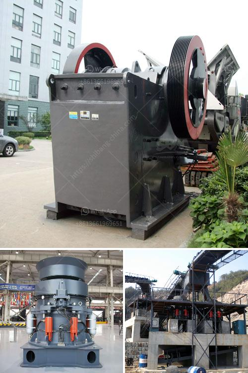

<h3>crusehr processing plant malaysia</h3>
Malaysia is known for its strong and vibrant economy, with a significant emphasis on the industrial sector. As a result, there are numerous factories and processing plants spread throughout the country. One such facility that plays a crucial role in the Malaysian economy is the crusher processing plant.

A crusher processing plant is designed to crush large rocks or ores into smaller pieces through various processes. It serves as a crucial component in the construction, mining, and recycling industries. These plants make it possible to utilize raw materials effectively, thus contributing to the economic growth of the country.

One prominent crusher processing plant in Malaysia is located in the Klang Valley. It has been in operation for more than four decades, producing various aggregates for the construction industry. The plant has earned a reputation for its exceptional quality and consistent supply, making it a preferred choice for numerous construction projects.

The plant's operations involve multiple stages. Initially, raw materials are extracted from quarries or mines and transported to the plant. The materials are then sorted based on their size and quality. Large pieces are sent through primary crushers, where they are reduced in size. The crushed materials are then further processed through secondary and tertiary crushers until the desired size is achieved.

Additionally, the plant incorporates various screening and washing processes to ensure the production of high-quality aggregates. These processes remove impurities, such as dust and clay, improving the overall quality of the final product. The processed aggregates are then classified into different sizes, ready to be used in construction projects.

Apart from producing aggregates, some crusher processing plants in Malaysia also specialize in recycling construction waste. Concrete and asphalt waste from demolished structures are crushed and processed to create recycled aggregates. This helps in minimizing the environmental impact of construction activities and reducing the consumption of natural resources.

Moreover, crusher processing plants play a significant role in maintaining the sustainability of the construction industry in Malaysia. By offering a reliable supply of aggregates, these plants support the development of infrastructure projects, including highways, bridges, and buildings. The availability of quality aggregates ensures that constructions are durable and meet the required standards.

In recent years, the crusher processing plant in Malaysia has also been adapting to emerging technologies. Automation and digitalization have improved the efficiency of operations, reducing downtime and enhancing productivity. These advancements have allowed the plant to meet the increasing demand for aggregates more effectively.

Overall, crusher processing plants in Malaysia play a pivotal role in the country's industrial development. By transforming raw materials into valuable aggregates, these facilities support construction projects while promoting sustainable practices. With ongoing advancements and a focus on quality, Malaysian crusher processing plants continue to contribute to the nation's economic growth and infrastructure development.
<h3>Contact us</h3><ul><li><strong>Whatsapp:&nbsp;<a href="https://wa.me/8613661969651">+8613661969651</a></strong></li><li><a href="https://swt.shibang-china.com/?git&amp;zhl&amp;crusehr processing plant malaysia"><strong>Online Service(chat now)</strong></a></li></ul><h3>Related</h3><ul><li><a href='talcum powder suppliers factories.md'>talcum powder suppliers factories</a></li><li><a href='classifier of cement ball mill.md'>classifier of cement ball mill</a></li><li><a href='hammer mill indutrial price malaysia.md'>hammer mill indutrial price malaysia</a></li><li><a href='ballast crusher sale kenya.md'>ballast crusher sale kenya</a></li><li><a href='sell jaw crusher jaw pe 250x400 tph.md'>sell jaw crusher jaw pe 250x400 tph</a></li></ul>