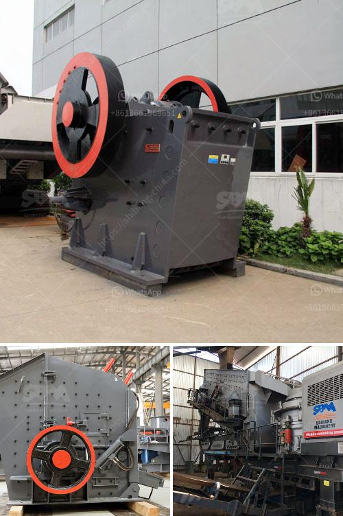

<h3>crushed stone suppliers manufacture india</h3>
India, with its ever-growing population and booming infrastructure development, has a tremendous appetite for construction materials. Among these, crushed stone, also known as construction aggregate, plays a significant role. It is one of the key ingredients used in the production of concrete, road base, and other construction materials. As a result, crushed stone suppliers in India play a crucial role in meeting the demands of the construction industry.

Crushed stone is a versatile material produced by crushing large stones into small pieces. It is commonly used as a base material for roads, driveways, and foundations. Additionally, it serves as an essential component in concrete production, making it an indispensable resource in the construction sector.

In India, there are numerous crushed stone suppliers that manufacture and supply this material across the country. These suppliers employ state-of-the-art technology and sophisticated machinery to crush and process stones, ensuring the highest quality standards. The manufacturing process involves several stages, including crushing, screening, washing, and sizing, to obtain the desired size and shape of crushed stones.

Quality control measures are of utmost importance for crushed stone suppliers in India. They conduct rigorous testing to ensure that the crushed stone meets various industry standards and specifications. This includes checking the chemical composition, gradation, and durability of the material. By adhering to these quality control measures, suppliers ensure that the crushed stone they produce is suitable for various construction applications.

Crushed stone suppliers in India not only focus on the quality of their products but also pay attention to environmental sustainability. They strive to minimize the impact on the environment by implementing eco-friendly practices in their manufacturing processes. This includes using modern equipment that reduces dust and noise pollution, as well as implementing efficient water management techniques.

The demand for crushed stone in India is driven by the numerous construction projects taking place across the country. The government's infrastructure development initiatives, such as the construction of highways, airports, and residential complexes, contribute significantly to the demand for crushed stone. Additionally, the growth in the real estate sector, including the establishment of commercial buildings and housing projects, further amplifies the need for crushed stone in India.

Crushed stone suppliers in India cater to the diverse requirements of their customers. They offer a wide range of products, including different sizes and types of crushed stone, such as granite, limestone, and basalt. This allows construction companies and contractors to select the most suitable crushed stone for their specific projects.

Furthermore, crushed stone suppliers in India provide excellent customer service and support. They have a dedicated team of professionals who assist customers in choosing the right crushed stone for their projects and provide technical advice. Additionally, timely delivery and competitive pricing are crucial aspects that suppliers prioritize to maintain long-term relationships with their customers.

In conclusion, crushed stone suppliers in India play a vital role in meeting the demands of the construction industry. Their manufacturing processes, quality control measures, and commitment to environmental sustainability ensure the production of high-quality crushed stone. With the growing infrastructure development in India, the demand for crushed stone continues to rise, making these suppliers indispensable to the construction sector.
<h3>Contact us</h3><ul><li><strong>Whatsapp:&nbsp;<a href="https://wa.me/8613661969651">+8613661969651</a></strong></li><li><a href="https://swt.shibang-china.com/?git&amp;zhl&amp;crushed stone suppliers manufacture india"><strong>Online Service(chat now)</strong></a></li></ul><h3>Related</h3><ul><li><a href='working principle of pebble mill.md'>working principle of pebble mill</a></li><li><a href='double roll crusher price lazada.md'>double roll crusher price lazada</a></li><li><a href='stone crushers for sale kenya.md'>stone crushers for sale kenya</a></li><li><a href='how to machine limestone.md'>how to machine limestone</a></li><li><a href='to calculate cost of limestone production in mining.md'>to calculate cost of limestone production in mining</a></li></ul>