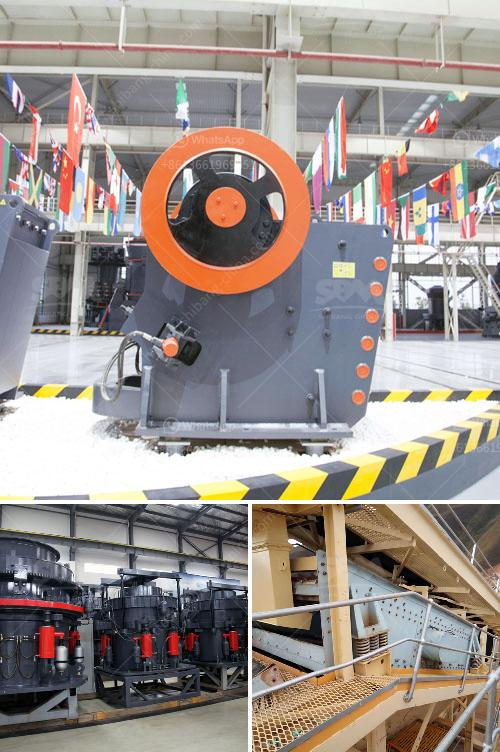

<h3>crusher agreegade suppliers durban</h3>
Crusher aggregate suppliers in Durban play a crucial role in the construction industry. They provide the necessary materials, such as sand, gravel, and other aggregates, which are essential in building structures and roads. With the growth and development happening in Durban, the demand for these materials has significantly increased.

Durban, known as South Africa's third-largest city, has seen a boom in its infrastructure projects, including the construction of new buildings, roads, and bridges. These projects require a constant supply of aggregates to ensure smooth operations and timely completion. That is where crusher aggregate suppliers come into play.

These suppliers have established crushing plants and quarries in and around Durban to meet the growing demand for aggregates. They have the necessary equipment and machinery to produce a wide range of materials suitable for various applications. From crushed stone to sand, they can provide the right type and size of aggregate required by construction companies and contractors.

One of the significant advantages of relying on crusher aggregate suppliers in Durban is the consistent quality of their products. These suppliers adhere to strict quality control measures throughout the production process. They conduct regular tests and inspections to ensure that the aggregates meet the required specifications and standards. This ensures that the materials used in construction are of high quality, resulting in durable and long-lasting structures.

Another benefit of working with crusher aggregate suppliers in Durban is the availability and accessibility of their products. With crushing plants strategically located in the city, they can easily transport aggregates to construction sites. This reduces the transportation costs and time associated with sourcing materials from distant locations. Contractors and builders can rely on these suppliers to deliver the required aggregates promptly, allowing construction projects to proceed smoothly.

In addition to supplying aggregates, crusher aggregate suppliers in Durban also offer various related services. They can assist with site preparation, excavation, and recycling of construction waste. These additional services further enhance their value proposition and make them a preferred choice for construction companies in Durban.

When selecting a crusher aggregate supplier in Durban, it is essential to consider their reputation and track record. Working with established and reputable suppliers ensures that you receive high-quality materials and reliable services. It is also advisable to verify the certifications and licenses held by these suppliers to ensure compliance with industry regulations.

In conclusion, crusher aggregate suppliers in Durban are indispensable in the construction industry. They provide a steady supply of quality aggregates required for various construction projects. Their services and products contribute to the development and growth of the city's infrastructure. By working with these suppliers, builders and contractors can ensure the timely completion of their projects while maintaining the highest standards of quality.
<h3>Contact us</h3><ul><li><strong>Whatsapp:&nbsp;<a href="https://wa.me/8613661969651">+8613661969651</a></strong></li><li><a href="https://swt.shibang-china.com/?git&amp;zhl&amp;crusher agreegade suppliers durban"><strong>Online Service(chat now)</strong></a></li></ul><h3>Related</h3><ul><li><a href='price hammer crusher in nigeria.md'>price hammer crusher in nigeria</a></li><li><a href='best wash plant for gold mining.md'>best wash plant for gold mining</a></li><li><a href='gold conveyor belts south africa.md'>gold conveyor belts south africa</a></li><li><a href='costo de la planta de procesamiento de coltan.md'>costo de la planta de procesamiento de coltan</a></li><li><a href='jaw crusher with production capacity of 80 100 ton hr.md'>jaw crusher with production capacity of 80 100 ton hr</a></li></ul>