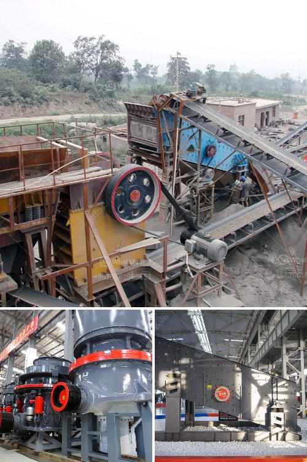

<h3>crusher chromite sand buyers china</h3>
China, the world's largest consumer of chromite sand, has witnessed a significant rise in the demand for this versatile mineral. As a key component in various industries, including steel manufacturing, foundry, and refractory, chromite sand has become an indispensable material. This surge in demand has, in turn, led to an increased interest from crusher chromite sand buyers in China.

Chromite sand is a natural source of chromium and iron, which makes it an ideal material for the production of stainless steel and other alloys. Its unique properties, such as high melting point, resistance to corrosion, and excellent casting characteristics, have made it a preferred choice for many industries. This has prompted crusher chromite sand buyers in China to seek reliable suppliers who can meet their needs.

One of the key reasons behind the popularity of chromite sand is its application in the foundry industry. Foundries use chromite sand to produce molds and cores for metal casting. Its high thermal conductivity and low thermal expansion make it an excellent material for creating intricate castings with precise dimensions and smooth surfaces. This has made it an essential component in automotive, aerospace, and other manufacturing industries, driving the demand for crusher chromite sand buyers in China.

Furthermore, the refractory industry also heavily relies on chromite sand, as it is used in the production of refractory bricks and castables. Refractory materials are essential for maintaining high temperatures in various industrial processes, including steelmaking, cement production, and glass manufacturing. The ability of chromite sand to withstand high temperatures and chemical erosion makes it an ideal component for these applications, contributing to the increasing interest from crusher chromite sand buyers in China.

In conclusion, the demand for chromite sand in China has seen a remarkable increase, primarily driven by its extensive use in industries like foundry and refractory. The unique physical and chemical properties of chromite sand make it an indispensable material for manufacturing processes that require high-quality castings, resistance to corrosion, and thermal stability. As a result, crusher chromite sand buyers in China are actively searching for reliable suppliers who can provide them with a steady and high-quality supply of this versatile mineral.
<h3>Contact us</h3><ul><li><strong>Whatsapp:&nbsp;<a href="https://wa.me/8613661969651">+8613661969651</a></strong></li><li><a href="https://swt.shibang-china.com/?git&amp;zhl&amp;crusher chromite sand buyers china"><strong>Online Service(chat now)</strong></a></li></ul><h3>Related</h3><ul><li><a href='sand screening machine philippines.md'>sand screening machine philippines</a></li><li><a href='scrap prices per ton in south africa.md'>scrap prices per ton in south africa</a></li><li><a href='crusher rental companies in oman.md'>crusher rental companies in oman</a></li><li><a href='buy ultra fine grinder mill.md'>buy ultra fine grinder mill</a></li><li><a href='stone crusher plant in kenya.md'>stone crusher plant in kenya</a></li></ul>