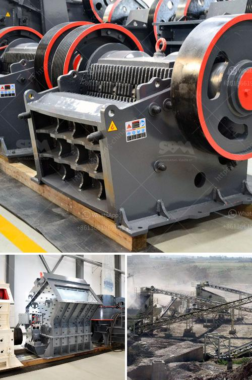

<h3>crusher cost equipment crusher malaysia</h3>
In the construction, mining, and recycling industries, having the right equipment for the job is crucial to ensure efficiency, cost-effectiveness, and safety. One of the primary machines used in these industries is the crusher, which is designed to reduce large rocks into smaller rocks, gravel, or rock dust. As Malaysia's construction and infrastructure projects continue to evolve, the demand for crushers has significantly increased. This article will provide an overview of crusher cost equipment in Malaysia, highlighting the importance of investing in reliable and efficient machinery.

When considering crusher cost equipment in Malaysia, several factors need to be taken into account. The initial investment cost is one of the primary considerations. It includes not only the price of the crusher itself but also any additional equipment required, such as conveyors, feeders, screens, or hoppers. The price can vary depending on the type and model of the crusher and the required capacity.

Besides the initial investment, operational costs should also be considered. These costs include maintenance, energy consumption, and wear parts replacement. Opting for a high-quality crusher with advanced technology can help reduce operational costs in the long run. Such crushers are designed to be more energy-efficient, require less frequent maintenance, and have better wear parts durability.

Furthermore, the choice of crusher depends on the specific application and the type of material being processed. Different crushers are designed for different materials, such as concrete, asphalt, limestone, or granite. Each material has its own unique characteristics and requires a specific type of crusher to achieve optimal results. Therefore, it is essential to consult with industry experts or crusher manufacturers to select the right equipment for the specific needs of the project.

In Malaysia, there are several reputable crusher manufacturers and suppliers that offer a wide range of equipment suitable for various applications. Some manufacturers even provide customized crushers to meet specific requirements. When selecting a supplier, it is crucial to consider factors such as their reputation, experience in the industry, after-sales support, and the availability of spare parts. Reputable suppliers often offer comprehensive support services, including training, maintenance, and repair services, ensuring uninterrupted productivity.

Investing in high-quality crusher equipment in Malaysia offers numerous benefits. Firstly, it enhances productivity by efficiently breaking down large rocks into smaller, manageable sizes. This enables easier handling, transportation, and further processing of the material. Secondly, it improves the quality of the final product by ensuring consistent particle size distribution, which is crucial for producing high-quality construction materials. Finally, it reduces production costs by minimizing downtime, repair expenses, and energy consumption.

Moreover, choosing the right crusher equipment can contribute to environmental sustainability. Modern crushers are designed to be more eco-friendly by incorporating advanced technologies that reduce noise levels, dust emissions, and energy consumption. Some crushers also offer features to control dust and prevent material spillage, further minimizing the environmental impact of crushing operations.

In conclusion, selecting the right crusher cost equipment in Malaysia is an important decision for construction, mining, and recycling companies. It involves considering factors such as initial investment, operational costs, material requirements, and the reliability of the supplier. By investing in high-quality crushers, companies can improve productivity, produce high-quality materials, reduce production costs, and contribute to environmental sustainability. It is advisable to conduct thorough research, consult with industry experts, and compare various options before making a final decision.
<h3>Contact us</h3><ul><li><strong>Whatsapp:&nbsp;<a href="https://wa.me/8613661969651">+8613661969651</a></strong></li><li><a href="https://swt.shibang-china.com/?git&amp;zhl&amp;crusher cost equipment crusher malaysia"><strong>Online Service(chat now)</strong></a></li></ul><h3>Related</h3><ul><li><a href='mobile iron ore jaw crusher for hire in india.md'>mobile iron ore jaw crusher for hire in india</a></li><li><a href='how much does a quarry machine cost.md'>how much does a quarry machine cost</a></li><li><a href='how to charge grinding media in ball mill.md'>how to charge grinding media in ball mill</a></li><li><a href='crusher machine vendor in penang.md'>crusher machine vendor in penang</a></li><li><a href='stone crusher plant sweden.md'>stone crusher plant sweden</a></li></ul>