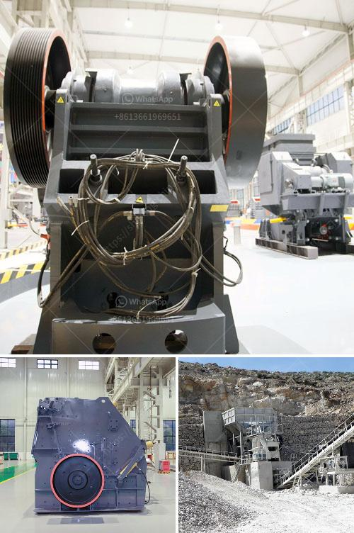

<h3>crusher equipment oman in oman</h3>
Nestled in the southeastern corner of the Arabian Peninsula, the Sultanate of Oman has a rich and diverse geological heritage. Blessed with abundant mineral resources, Oman is among the leading producers of minerals globally, particularly iron ore, copper, gold, limestone, and gypsum. The mining industry plays a significant role in the country's economic development, and crusher equipment plays a crucial role in extracting and processing minerals efficiently and cost-effectively.

Crusher equipment refers to the machinery used to crush or break stones, rocks, and other hard materials into smaller sizes for various applications. Its importance in many industries cannot be overstated, as it is used extensively in the mining, construction, and recycling sectors. These machines facilitate the extraction of minerals by reducing large rocks into smaller, more manageable sizes.

In Oman, several companies specialize in manufacturing and supplying crusher equipment that meets the country's mining needs. These machines are essential for extracting and processing minerals like limestone, gypsum, laterite, and iron ore. With varying degrees of hardness, these minerals require robust and efficient crushers that can withstand demanding conditions.

Among the most commonly used crushers in Oman's mining industry are jaw crushers, cone crushers, impact crushers, and hammer crushers. Each type serves a specific purpose and has unique characteristics that make it suitable for different tasks. For instance, jaw crushers are ideal for primary crushing, while cone crushers excel in secondary and tertiary crushing applications.

Impact crushers are particularly suited for processing softer, less abrasive materials, while hammer crushers are ideal for breaking down materials with high hardness and brittleness. With a wide range of crusher equipment available in Oman, miners can choose the most suitable machine for their specific needs, ensuring optimal productivity and cost-efficiency.

Moreover, crusher equipment in Oman is often equipped with advanced technologies that enhance their performance and minimize downtime. For example, many crushers now feature hydraulic systems that enable easy adjustment of the crusher's output size and ensure consistent and precise crushing results. Furthermore, state-of-the-art control systems and sensor technologies enable real-time monitoring, maximizing operational efficiency and minimizing maintenance requirements.

The availability of quality crusher equipment in Oman has not only fueled the country's mining industry but also facilitated the growth of other sectors. For instance, the construction industry relies on crusher equipment to crush and recycle construction waste and produce high-quality aggregates for various applications.

Additionally, crusher equipment plays a crucial role in the recycling industry by reducing the size of recyclable materials such as concrete, asphalt, and glass. By transforming waste into valuable resources, these machines support sustainable development in Oman.

In conclusion, crusher equipment in Oman is essential for the country's mining industry. With its abundant mineral resources, Oman has a strong demand for crushers that efficiently and effectively extract and process minerals. Whether it is for primary, secondary, or tertiary crushing, a wide range of crusher equipment is available to meet Oman's diverse mining needs. Equipped with advanced technologies and features, these machines ensure optimal productivity, cost-efficiency, and environmental sustainability.
<h3>Contact us</h3><ul><li><strong>Whatsapp:&nbsp;<a href="https://wa.me/8613661969651">+8613661969651</a></strong></li><li><a href="https://swt.shibang-china.com/?git&amp;zhl&amp;crusher equipment oman in oman"><strong>Online Service(chat now)</strong></a></li></ul><h3>Related</h3><ul><li><a href='cde sand wash plant for sale.md'>cde sand wash plant for sale</a></li><li><a href='kaolin clay crusher manufacturing process.md'>kaolin clay crusher manufacturing process</a></li><li><a href='mobile crusher plant for hire in mpumalanga province.md'>mobile crusher plant for hire in mpumalanga province</a></li><li><a href='pulviriser machine in allahabad.md'>pulviriser machine in allahabad</a></li><li><a href='barite rock mill.md'>barite rock mill</a></li></ul>