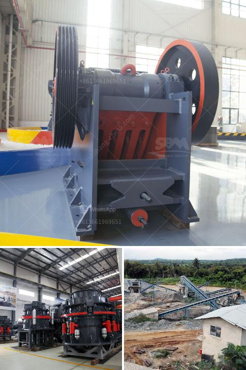

<h3>crusher for sale peru</h3>
Peru, known as the land of hidden treasures, has been one of the world's leading mining countries for decades. Its rich mineral resources, including gold, silver, copper, and zinc, have attracted investors from around the globe. This has led to the rapid expansion of the mining industry in Peru, making it a key player in the global mining market. As mining operations continue to flourish, the demand for efficient and reliable crushing equipment has also increased. Hence, the availability of high-quality crushers for sale in Peru has become paramount.

Crushers play a significant role in the mining sector as they are used to break down large-sized rocks and ores into smaller particles, facilitating further processing. These robust machines are designed to handle the toughest and most demanding materials that occur in mining operations. As a result, they are built to withstand heavy workloads and harsh environments, ensuring uninterrupted mining activities.

In Peru, crushers are widely used in various mining applications, from primary crushing to secondary and tertiary crushing stages. They are utilized in open-pit mining as well as underground operations. Moreover, crushers are also essential in processing plants, where various minerals are further refined and separated. Thus, acquiring a crusher that suits specific project requirements is crucial for maximizing productivity and profitability.

When searching for crushers for sale in Peru, one should consider several key factors. First and foremost is the crushing capacity required to meet the operational needs. Depending on the scale of the mining project, crushers may range from small portable units to larger stationary models. It is essential to assess the desired output size and choose a crusher accordingly, as different crushers have varying capabilities in terms of final product size.

The type of crusher is another crucial consideration. Common types include jaw crushers, cone crushers, impact crushers, and gyratory crushers. Each type offers unique advantages and are suitable for different applications. For instance, jaw crushers are ideal for primary crushing, while cone crushers are often used for secondary and tertiary crushing stages. Impact crushers, on the other hand, are suitable for processing softer materials.

Furthermore, the quality and durability of the crusher should be evaluated thoroughly. As mining operations often entail continuous and heavy-duty usage of crushing equipment, it is imperative to invest in reliable machines that can withstand such demanding conditions. Ensuring that the crusher is built with high-quality materials and components guarantees its longevity and minimizes costly downtime resulting from mechanical failures.

In conclusion, Peru's thriving mining sector calls for the availability of efficient and reliable crushers. These machines are indispensable in the mining industry as they break down large rocks and ores into smaller particles. Careful consideration must be given to factors such as crushing capacity, type of crusher, and overall quality and durability. By acquiring the right crusher for sale in Peru, mining companies can unlock the full potential of their operations, enhancing productivity and contributing to Peru's economic growth.
<h3>Contact us</h3><ul><li><strong>Whatsapp:&nbsp;<a href="https://wa.me/8613661969651">+8613661969651</a></strong></li><li><a href="https://swt.shibang-china.com/?git&amp;zhl&amp;crusher for sale peru"><strong>Online Service(chat now)</strong></a></li></ul><h3>Related</h3><ul><li><a href='hammer mill machine buy.md'>hammer mill machine buy</a></li><li><a href='horizontal impact crusher for sale.md'>horizontal impact crusher for sale</a></li><li><a href='cost of the project for 100 tph stone crushing unit.md'>cost of the project for 100 tph stone crushing unit</a></li><li><a href='small scale marble crushing and processing industery.md'>small scale marble crushing and processing industery</a></li><li><a href='costo de la planta de procesamiento de coltan.md'>costo de la planta de procesamiento de coltan</a></li></ul>